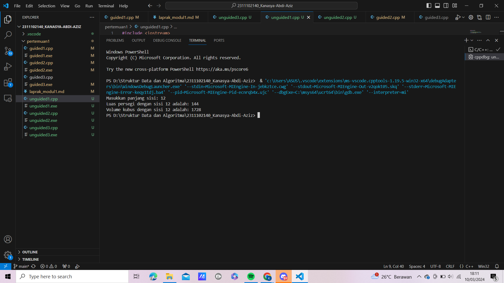
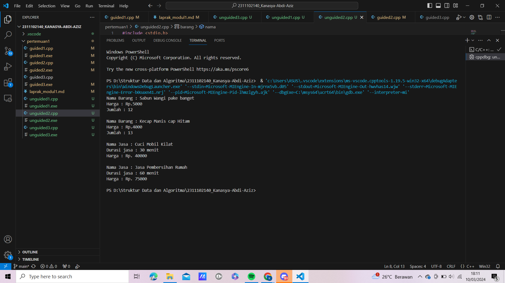
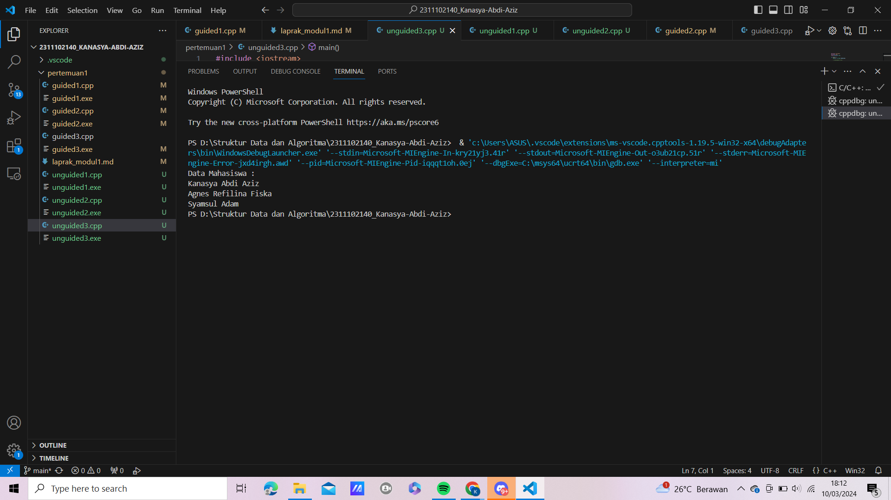

# <h1 align="center">Laporan Praktikum Modul Tipe Data</h1>
<p align="center">Kanasya Abdi Aziz - 2311102140</p>
<p align="center">Kanasya Abdi Aziz - 2311102140</p>

## Dasar Teori

Tipe data adalah klasifikasi data berdasarkan jenisnya. Tipe data
diperlukan agar kompiler dapat mengetahui bagaimana sebuah data akan
digunakan. Berikut adalah beberapa jenis tipe data:
1. Tipe Data Primitif
Tipe data primitif adalah tipe data yang sudah ditentukan oleh
sistem. Bahasa pemrograman umumnya menyediakan tipe data
primitif, namun jumlah bit yang dialokasikan untuk setiap bit pada tipe
data primitif dapat berbeda-beda tergantung pada bahasa pemrograman,
compiler, dan sistem operasinya. Berikut adalah beberapa contoh tipe
data primitif:
a. Int: Digunakan untuk menyimpan bilangan bulat seperti 15, 3, 1,
dan sebagainya.
b. Float: Digunakan untuk menyimpan bilangan desimal seperti 9.2,
24.1, 3.14, dan sebagainya.
c. Char: Digunakan untuk menyimpan data berupa sebuah huruf,
seperti X, Y, Z, dan seterusnya.
d. Boolean: Digunakan untuk menyimpan nilai boolean yang hanya
memiliki dua nilai yaitu true dan false.

2. Tipe Data Abstrak
Tipe data abstrak (ADT) adalah tipe data yang dibentuk oleh
programmer sendiri. ADT dapat berisi banyak tipe data, sehingga
nilainya bisa lebih dari satu dan beragam. ADT umumnya dibuat
menggunakan fitur Class dalam bahasa pemrograman berorientasi
objek (OOP). Fitur Class mirip dengan fitur data structures Struct pada
bahasa C. Keduanya berfungsi untuk membungkus tipe data di
dalamnya sebagai anggota.

3. Tipe Data Koleksi
Tipe data koleksi adalah tipe data yang digunakan untuk
mengelompokkan dan menyimpan beberapa nilai atau objek secara
bersamaan. Tipe data koleksi memungkinkan Anda menyimpan,
mengelola, dan mengakses sejumlah besar data dengan cara yang
terstruktur. Berikut adalah beberapa contoh tipe data koleksi:
a. Array: Struktur data statis yang menyimpan elemen-elemen
dengan tipe data yang sama. Elemen-elemen tersebut dapat
diakses dengan menggunakan indeks. Array memiliki ukuran
tetap yang ditentukan saat deklarasi.
b. Vector: Mirip dengan array, namun memiliki kemampuan untuk
menyimpan data dalam bentuk elemen-elemen yang alokasi
memorinya dilakukan otomatis dan bersebelahan. Vector bukan
hanya pada jumlah elemen yang dinamis, tetapi juga dilengkapi
dengan fitur-fitur pelengkap seperti element access, iterators,
capacity, dan modifiers.
c. Map: Mirip dengan array, namun dengan indeks yang
memungkinkan untuk berupa tipe data selain integer. Pada map,
indeks tersebut diberi nama “key”. Map umumnya
menggunakan Self-Balancing Tree, khususnya Red-Black Tree.

## Guided 

### 1. [Tipe Data Primitif]

```C++
#include <iostream>
#include <iomanip>
using namespace std;

int main(){
    char op;
    float num1, num2;

    // it allows user to enter operator i.e. +, -, *,/
    cout<<"Enter operator (+, -, *, /): ";
    cin>>op;

    // it allows user to enter the operands
    cout<<"Enter two operands: ";
    cin>>num1>>num2;

    // switch statement begins
    switch (op){
        // if user enters +
        case '+':
            cout<<"Result: "<<num1 + num2;
            break;
        // if user enters -
        case '-':
            cout<<"Result: "<<num1 - num2;
            break;
        // if user enter *
        case '*':
            cout<<"Result: "<<num1 * num2;
            break;
        // if user enter /
        case '/':
            if (num2 != 0) {
                cout<<"Result: "<< fixed << setprecision(2)<< num1 / num2;

    } else {
        cout << "Error! Division by zero is not allowed.";
    }
    break;
    // if the operator is other than +, -, *, /'
    // error message will display
    default:
        cout<<"Error! Operator is not correct";
    } // switch statement ends

    return 0;
}
```
Kode di atas digunakan untuk memilih operasi penambahan (+), pengurangan (-), perkalian (*), dan pembagian (/). Keempat operasi ini akan jalan jika user sudah menginput dua angka pada saat penginputan cin. Terdapat juga dua tipe data primitif pada program ini, yaitu char dan float. Tipe data char digunakan pada saat pemilihan switch case dan float digunakan sebagai tipe data 2 angka yang diinput user.

### 2. [Tipe Data Abstrak]

```C++
#include <stdio.h>
#include <string.h>

// struct
struct Mahasiswa
{
    char name[50];
    char address[100];
    int age;
};
int main()
{
    // menggunakan struct
    struct Mahasiswa mhs1, mhs2;
    // mengisi nilai ke struct
    strcpy(mhs1.name, "Dian");
    strcpy(mhs1.address, "Mataram");
    mhs1.age = 22;
    strcpy(mhs2.name, "Bambang");
    strcpy(mhs2.address, "Surabaya");
    mhs2.age = 23;

    // mencetak isi sturct
    printf("## Mahasiswa 1 ##\n");
    printf("Nama: %s\n", mhs1.name);
    printf("Alamat: %s\n", mhs1.address);
    printf("Umur: %d\n", mhs1.age);
    printf("\n");
    printf("## Mahasiswa 2 ##\n");
    printf("Nama: %s\n", mhs2.name);
    printf("Alamat: %s\n", mhs2.address);
    printf("Umur: %d\n", mhs2.age);
    return 0;
}
```
Kode di atas digunakan untuk mencetak isi dari struct. Struct merupakan salah satu contoh dari tipe data abstrak. Pada kode di atas terdapat sebuah struct Mahasiswa. Pada struct Mahasiswa ini, terdapat 3 nilai, yaitu char name dengan ukuran 50, char address dengan ukuran 50 juga, dan int age. Lalu pada int main, diisi nilai dan dideklarasikan struct Mahasiswa dengan 2 objek, yaitu mhs1 dengan nama Dian dan mhs2 dengan nama Bambang.

### 3. [Tipe Data Koleksi]

```C++
#include <iostream> 
#include <array> 
using namespace std; 
 
int main() { 
    // Deklarasi dan inisialisasi array 
    int nilai[5]; 
    nilai[0] = 23; 
    nilai[1] = 50; 
    nilai[2] = 34; 
    nilai[3] = 78; 
    nilai[4] = 90; 
 
    // Mencetak array dengan tab 
    cout << "Isi array pertama  : " << nilai[0] << endl; 
    cout << "Isi array kedua    : " << nilai[1] << endl; 
    cout << "Isi array ketiga   : " << nilai[2] << endl; 
    cout << "Isi array keempat  : " << nilai[3] << endl; 
    cout << "Isi array kelima   : " << nilai[4] << endl; 
 
    return 0; 
}
```
Kode di atas digunakan untuk mencetak isi dari sebuah array. Array merupakan salah satu contoh dari tipe data koleksi. Pada kode di atas, terdapat library array yang membantu proses pemrogramannya. Terdapat array nilai yang dapat menampung 5 nilai, yaitu 23, 50, 34, 78, dan 90. Lalu dideklarasikan di bawahnya.
## Unguided 

### 1. [Buatlah program menggunakan tipe data primitif minimal dua fungsi dan bebas. Menampilkan program, jelaskan program tersebut dan ambil kesimpulan dari materi tipe data primitif!]

```C++
#include <iostream>
using namespace std;

// Fungsi untuk menghitung luas persegi
double hitungLuasPersegi_140(double sisi) {
    return sisi * sisi;
}

// Fungsi untuk menghitung volume kubus
double hitungVolumeKubus_140(double sisi) {
    return sisi * sisi * sisi;
}

int main() {
    double sisi;

    // memasukan panjang sisi persegi atau kubu
    cout << "Masukkan panjang sisi: ";
    cin >> sisi;

    // pemanggilan 
    double luasPersegi = hitungLuasPersegi_140(sisi);
    double volumeKubus = hitungVolumeKubus_140(sisi);

    // hasil output
    cout << "Luas persegi dengan sisi " << sisi << " adalah: " << luasPersegi << endl;
    cout << "Volume kubus dengan sisi " << sisi << " adalah: " << volumeKubus << endl;

    return 0;
}
```
#### Output:


Program di atas merupakan sebuah program sederhana dalam bahasa C++ yang menghitung luas persegi dan volume kubus berdasarkan panjang sisi yang dimasukkan oleh pengguna. Program ini menggunakan dua buah fungsi, yaitu `hitungLuasPersegi_140` untuk menghitung luas persegi dan `hitungVolumeKubus_140` untuk menghitung volume kubus. Setelah mengambil input dari pengguna berupa panjang sisi, program akan menghitung luas persegi dan volume kubus menggunakan fungsi-fungsi yang telah didefinisikan, kemudian menampilkan hasilnya ke layar. Program ini memberikan pengguna pemahaman dasar tentang bagaimana menggunakan fungsi, mengambil input dari pengguna, melakukan perhitungan sederhana, dan menampilkan output di C++.

### 2. [Jelaskan fungsi dari class dan struct secara detail dan berikan contoh programnya!]

```C++
#include <stdio.h>
#include <string>
#include <iostream>
using namespace std;

// Contoh Struct
struct barang {
string nama;
int harga, jumlah;

};

// Contoh Class
class Jasa
{
private:
    string nama;
    int waktu;
    int harga;

public:
    // Konstruktor untuk inisialisasi objek Jasa
    Jasa(string namaJasa, int waktuJasa, int hargaJasa) {
        nama = namaJasa;
        waktu = waktuJasa;
        harga = hargaJasa;
}

    // Method untuk menampilkan informasi jasa
    void tampilkanInfo() {
        cout << "Nama Jasa : " << nama << endl;
        cout << "Durasi jasa : " << waktu << " menit" << endl;
        cout << "Harga : Rp. " << harga << endl << endl;
    }
};

int main() {

    // Contoh Penggunaan Struct
    barang sabun, kecap;

    sabun.nama = "Sabun Wangi pake banget";
    sabun.harga = 5000;
    sabun.jumlah = 12;
    kecap.nama = "Kecap Manis cap Hitam";
    kecap.harga = 4000;
    kecap.jumlah = 13;

    cout << "Nama Barang : " << sabun.nama << endl
        << "Harga : Rp." << sabun.harga << endl
        << "Jumlah : " << sabun.jumlah << endl << endl;
    cout << "Nama Barang : " << kecap.nama << endl
        << "Harga : Rp." << kecap.harga << endl
        << "Jumlah : " << kecap.jumlah << endl << endl;
    
    // Contoh Penggunaan Class
    Jasa cuci("Cuci Mobil Kilat", 30, 40000);
    Jasa kebersihan("Jasa Pembersihan Rumah", 60, 75000);
    cuci.tampilkanInfo();
    kebersihan.tampilkanInfo();
}
```
#### Output:


Program di atas merupakan sebuah contoh penggunaan struct dan class dalam bahasa C++. Struct barang digunakan untuk merepresentasikan informasi mengenai barang-barang seperti nama, harga, dan jumlah. Sementara itu, class Jasa digunakan untuk merepresentasikan informasi mengenai jasa-jasa seperti nama, durasi, dan harga.

Pada bagian main(), terdapat contoh penggunaan struct dan class. Untuk struct, terdapat dua objek sabun dan kecap yang merepresentasikan dua barang berbeda. Setiap objek memiliki atribut-atribut seperti nama, harga, dan jumlah, yang kemudian ditampilkan ke layar. Selanjutnya, terdapat dua objek dari class Jasa, yaitu cuci dan kebersihan, yang mewakili dua jenis jasa dengan informasi yang berbeda. Informasi dari setiap objek class juga ditampilkan ke layar dengan menggunakan method tampilkanInfo().

Program ini memberikan pengguna pemahaman tentang bagaimana menggunakan struct dan class untuk merepresentasikan data dan perilaku dalam program C++, serta cara mengakses atribut dan method dari objek-objek yang dibuat dari struct dan class tersebut.

### 3. [Jelaskan fungsi dari class dan struct secara detail dan berikan contoh programnya!]

```C++
#include <iostream>
#include <map>
using namespace std;

int main() {
    map<int, string> mahasiswa;

    // penyimpanan array
    mahasiswa[2311102140] = "Kanasya Abdi Aziz";
    mahasiswa[2311102126] = "Agnes Refilina Fiska";
    mahasiswa[2311102144] = "Syamsul Adam";

        // pemanggilan array
        cout << "Data Mahasiswa : " << endl;
        cout << mahasiswa[2311102140] << endl
            << mahasiswa[2311102126] << endl
            << mahasiswa[2311102144] << endl;
}
```
#### Output:



Script di atas merupakan contoh penggunaan struktur data map dalam bahasa C++. map adalah sebuah struktur data asosiatif yang memetakan kunci (keys) ke nilai-nilai (values). Pada contoh tersebut, map digunakan untuk menyimpan data mahasiswa berupa nomor mahasiswa sebagai kunci dan nama mahasiswa sebagai nilai.

Setelah membuat map dengan tipe data int sebagai kunci dan string sebagai nilai, beberapa pasangan kunci-nilai ditambahkan ke dalam map dengan menggunakan operator []. Kemudian, data mahasiswa tersebut ditampilkan ke layar dengan mengakses nilai pada setiap kunci menggunakan operator [].

Program ini memberikan pemahaman tentang cara menggunakan map untuk menyimpan data dalam bentuk pasangan kunci-nilai dan cara mengakses nilai-nilai tersebut menggunakan kunci yang sesuai.

## Kesimpulan
Tipe data dalam pemrograman sangat penting untuk mengorganisir dan mengelola data dalam sebuah program. Tipe data primitif seperti int, float, char, dan boolean digunakan untuk menyimpan nilai sederhana dan dapat menjalankan operasi dasar, sedangkan tipe data abstrak dan koleksi memungkinkan pengelompokan data yang lebih kompleks dan terstruktur. Implementasi struktur data seperti array, struct, dan map memiliki karakteristik yang berbeda dan digunakan sesuai dengan kebutuhan program


## Referensi
[1] I. Holm, Narrator, and J. Fullerton-Smith, Producer, How to Build a Human [DVD]. London: BBC; 2002.