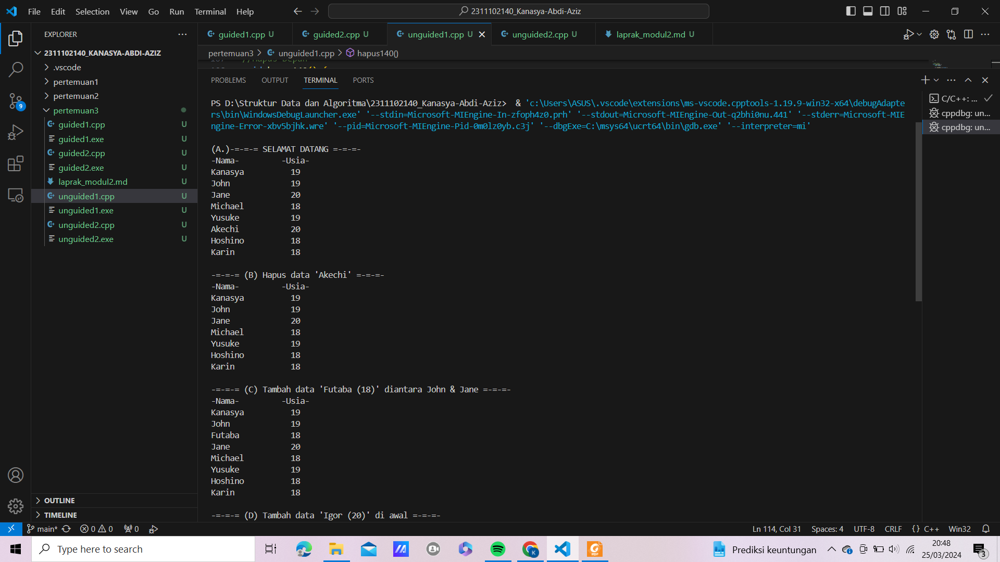
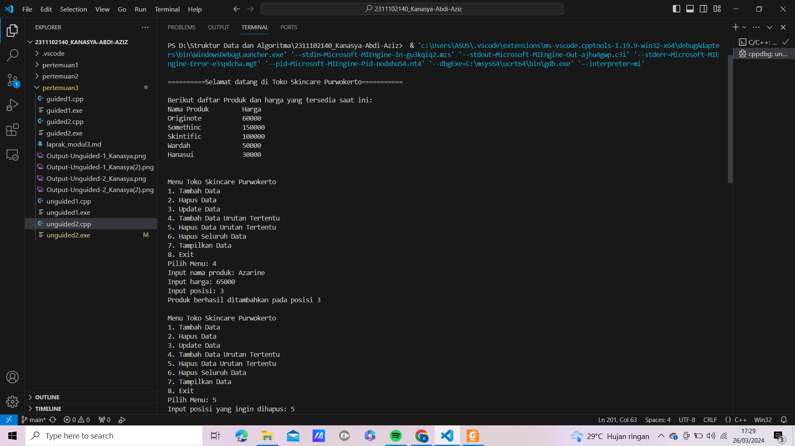

# <h1 align="center">Laporan Praktikum Modul Single and Double Linked List</h1>
<p align="center">Kanasya Abdi Aziz - 2311102140</p>

## Dasar Teori

Salah satu bentuk struktur data yang berisi kumpulan data yang tersusun secara
sekuensial, saling bersambungan, dinamis dan terbatas adalah senarai berkait (linked list).
Suatu senarai berkait (linked list) adalah suatu simpul (node) yang dikaitkan dengan simpul yang
lain dalam suatu urutan tertentu. Suatu simpul dapat berbentuk suatu struktur atau class.
Simpul harus mempunyai satu atau lebih elemen struktur atau class yang berisi data. Secara
teori, linked list adalah sejumlah node yang dihubungkan secara linier dengan bantuan
pointer. Senarai berkait lebih efisien di dalam melaksanakan penyisipan-penyisipan dan
penghapusan-penghapusan. Senarai berkait juga menggunakan alokasi penyimpanan secara
dinamis, yang merupakan penyimpanan yang dialokasikan pada runtime. Karena di dalam
banyak aplikasi, ukuran dari data itu tidak diketahui pada saat kompile, hal ini bisa
merupakan suatu atribut yang baik juga. Setiap node akan berbentuk struct dan memiliki satu
buah field bertipe struct yang sama, yang berfungsi sebagai pointer. Dalam menghubungkan
setiap node, kita dapat menggunakan cara first-create-first-access ataupun first-create-lastaccess. Yang berbeda dengan deklarasi 
struct sebelumnya adalah satu field bernama next,
yang bertipe struct tnode. Hal ini sekilas dapat membingungkan. Namun, satu hal yang
jelas, variabel next ini akan menghubungkan kita dengan node di sebelah kita, yang
juga bertipe struct tnode. Hal inilah yang menyebabkan next harus bertipe struct tnode. 

## Guided 

### 1. [Latihan Single Linked List]

```C++
#include <iostream>
using namespace std;

//PROGRAM SINGLE LINKED LIST NON-CIRCULAR

//Deklarasi Struct Node
struct Node{
    int data;
    Node *next;
};

Node *head;
Node *tail;

//Inisialisasi Node
void init(){
    head = NULL;
    tail = NULL;
}

// Pengecekan
bool isEmpty(){
    if (head == NULL)
        return true;
    else
        return false;
}

//Tambah Depan
void insertDepan(int nilai){
    //Buat Node baru
    Node *baru = new Node;
    baru->data = nilai;
    baru->next = NULL;
    if (isEmpty() == true){
        head = tail = baru;
        tail->next = NULL;
    }
    else{
        baru->next = head;
        head = baru;
    }
}

//Tambah Belakang
void insertBelakang(int nilai){
    //Buat Node baru
    Node *baru = new Node;
    baru->data = nilai;
    baru->next = NULL;
    if (isEmpty() == true){
        head = tail = baru;
        tail->next = NULL;
    }
    else{
        tail->next = baru;
        tail = baru;
    }
}

//Hitung Jumlah List
int hitungList(){
    Node *hitung;
    hitung = head;
    int jumlah = 0;
    while( hitung != NULL ){
        jumlah++;
        hitung = hitung->next;
    }
    return jumlah;
}

//Tambah Tengah
void insertTengah(int data, int posisi){
    if( posisi < 1 || posisi > hitungList() ){
        cout << "Posisi diluar jangkauan" << endl;
    }
    else if( posisi == 1){
        cout << "Posisi bukan posisi tengah" << endl;
    }
    else{
        Node *baru, *bantu;
        baru = new Node();
        baru->data = data;
        // tranversing
        bantu = head;
        int nomor = 1;
        while( nomor < posisi - 1 ){
            bantu = bantu->next;
            nomor++;
        }
        baru->next = bantu->next;
        bantu->next = baru;
    }
}

//Hapus Depan
void hapusDepan() {
    Node *hapus;
    if (isEmpty() == false){
        if (head->next != NULL){
            hapus = head;
            head = head->next;
            delete hapus;
        }
        else{
            head = tail = NULL;
        }
    }
    else{
        cout << "List kosong!" << endl;
    }
}

//Hapus Belakang
void hapusBelakang() {
    Node *hapus;
    Node *bantu;
    if (isEmpty() == false){
        if (head != tail){
            hapus = tail;
            bantu = head;
            while (bantu->next != tail){
                bantu = bantu->next;
            }
            tail = bantu;
            tail->next = NULL;
            delete hapus;
        }
        else{
            head = tail = NULL;
        }
    }
    else{
        cout << "List kosong!" << endl;
    }
}

//Hapus Tengah
void hapusTengah(int posisi){
    Node *hapus, *bantu, *bantu2;
    if( posisi < 1 || posisi > hitungList() ){
        cout << "Posisi di luar jangkauan" << endl;
    }
    else if( posisi == 1){
        cout << "Posisi bukan posisi tengah" << endl;
    }
    else{
        int nomor = 1;
        bantu = head;
        while( nomor <= posisi ){
            if( nomor == posisi-1 ){
                bantu2 = bantu;
            }
            if( nomor == posisi ){
                hapus = bantu;
            }
            bantu = bantu->next;
            nomor++;
        }
        bantu2->next = bantu;
        delete hapus;
    }
}

//Ubah Depan
void ubahDepan(int data){
    if (isEmpty() == false){
        head->data = data;
    }
    else{
        cout << "List masih kosong!" << endl;
    }
}

//Ubah Tengah
void ubahTengah(int data, int posisi){
    Node *bantu;
    if (isEmpty() == false){
        if( posisi < 1 || posisi > hitungList() ){
            cout << "Posisi di luar jangkauan" << endl;
        }
        else if( posisi == 1){
            cout << "Posisi bukan posisi tengah" << endl;
        }
        else{
            bantu = head;
            int nomor = 1;
            while (nomor < posisi){
                bantu = bantu->next;nomor++;
            }
            bantu->data = data;
        }
    }
    else{
        cout << "List masih kosong!" << endl;
    }
}

//Ubah Belakang
void ubahBelakang(int data){
    if (isEmpty() == false){
tail->data = data;
}
  else{
cout << "List masih kosong!" << endl;
  }
}
//Hapus List
void clearList(){
Node *bantu, *hapus;
bantu = head;
while (bantu != NULL){
hapus = bantu;bantu = bantu->next;
delete hapus;
}
head = tail = NULL;
cout << "List berhasil terhapus!" << endl;
}
//Tampilkan List
void tampil(){
Node *bantu;
bantu = head;
if (isEmpty() == false){
while (bantu != NULL){
cout << bantu->data << ends;
bantu = bantu->next;
}
cout << endl;
}
else{
cout << "List masih kosong!" << endl;
}
}
int main(){
init();
insertDepan(3);tampil();
insertBelakang(5);
tampil();
insertDepan(2);
tampil();
insertDepan(1);
tampil();
hapusDepan();
tampil();
hapusBelakang();
tampil();
insertTengah(7,2);
tampil();
hapusTengah(2);
tampil();
ubahDepan(1);
tampil();
ubahBelakang(8);
tampil();
ubahTengah(11, 2);
tampil();
return 0;
}
```
Program ini adalah implementasi single linked list non-circular yang menggunakan struct Node. Program ini menyediakan fungsi untuk menambahkan elemen depan, belakang, tengah, menghapus elemen depan, belakang, tengah, mengubah elemen depan, belakang, tengah, dan menghapus semua elemen dari linked list. Program juga menampilkan isi linked list dengan fungsi tampil().

### 2. [Latihan Double Linked List]

```C++
#include <iostream>
using namespace std;

class Node {
public:
    int data;
    Node* prev;
    Node* next;
};

class DoublyLinkedList {
public:
    Node* head;
    Node* tail;
    DoublyLinkedList() {
        head = nullptr;
        tail = nullptr;
    }
    void push(int data) {
        Node* newNode = new Node;
        newNode->data = data;
        newNode->prev = nullptr;
        newNode->next = head;
        if (head != nullptr) {
            head->prev = newNode;
        }
        else {
            tail = newNode;
        }
        head = newNode;
    }
    void pop() {
        if (head == nullptr) {
            return;
        }
        Node* temp = head;
        head = head->next;
        if (head != nullptr) {
            head->prev = nullptr;
        }
        else {
            tail = nullptr;
        }
        delete temp;
    }
    bool update(int oldData, int newData) {
        Node* current = head;
        while (current != nullptr) {
            if (current->data == oldData) {
                current->data = newData;
                return true;
            }
            current = current->next;
        }
        return false;
    }
    void deleteAll() {
        Node* current = head;
        while (current != nullptr) {
            Node* temp = current;
            current = current->next;
            delete temp;
        }
        head = nullptr;
        tail = nullptr;
    }
    void display() {
        Node* current = head;
        while (current != nullptr) {
            cout << current->data << " ";
            current = current->next;
        }
        cout << endl;
    }
};

int main() {
    DoublyLinkedList list;
    while (true) {
        cout << "1. Add data" << endl;
        cout << "2. Delete data" << endl;
        cout << "3. Update data" << endl;
        cout << "4. Clear data" << endl;
        cout << "5. Display data" << endl;
        cout << "6. Exit" << endl;
        int choice;
        cout << "Enter your choice: ";
        cin >> choice;
        switch (choice) {
            case 1: {
                int data;
                cout << "Enter data to add: ";
                cin >> data;
                list.push(data);
                break;
            }
            case 2: {
                list.pop();
                break;
            }
            case 3: {
                int oldData, newData;
                cout << "Enter old data: ";
                cin >> oldData;
                cout << "Enter new data: ";
                cin >> newData;
                bool updated = list.update(oldData, newData);
                if (!updated) {
                    cout << "Data not found" << endl;
                }
                break;
            }
            case 4: {
                list.deleteAll();
                break;
            }
            case 5: {
                list.display();
                break;
            }
            case 6: {
                return 0;
            }
            default: {
                cout << "Invalid choice" << endl;
                break;
            }
        }
    }
    return 0;
}
```
Program ini adalah implementasi linked list dua arah (doubly linked list) yang menggunakan class Node dan DoublyLinkedList. Program ini menyediakan fungsi push, pop, update, deleteAll, dan display untuk menambahkan, menghapus, mengubah, menghapus semua, dan menampilkan elemen dari linked list. Program juga menampilkan pilihan untuk menambahkan, menghapus, mengubah, menghapus semua, dan menampilkan data, serta keluar dari program.

## Unguided 

### 1. [Buatlah program menu Single Linked List Non-Circular untuk menyimpan Nama dan Usia mahasiswa, dengan menggunakan inputan dari user. Lakukan operasi berikut:
a. Masukkan data sesuai urutan berikut. (Gunakan insert depan, belakang atau tengah). Data pertama yang dimasukkan adalah nama dan usia anda.
ㅤb. Hapus data Akechi
ㅤc. Tambahkan data berikut diantara John dan Jane: "Futaba 18"
ㅤd. Tambahkan data berikut di awal: "Igor 20"
ㅤe. Ubah data Michael menjadi: "Reyn 18"
ㅤf. Tampilkan seluruh data!]

```C++
#include <iostream>
#include <iomanip>
using namespace std;

//Deklarasi Struct Node
struct Node {
    string Nama140;
    int Umur140;
    Node* next;
};

Node* head;
Node* tail;

//Inisialisasi Node
void inisialisasi140() {
    head = NULL;
    tail = NULL;
}

// Pengecekan
bool cek140() {
    if (head == NULL)
        return true;
    else
        return false;
}

//Tambah Depan
void depan140(string name, int age) {
    //Buat Node baru
    Node* baru = new Node;
    baru->Nama140 = name;
    baru->Umur140 = age;
    baru->next = NULL;

    if (cek140() == true) {
        head = tail = baru;
        tail->next = NULL;
    }
    else {
        baru->next = head;
        head = baru;
    }
}

//Tambah Belakang
void belakang140(string name, int age) {
    //Buat Node baru
    Node* baru = new Node;
    baru->Nama140 = name;
    baru->Umur140 = age;
    baru->next = NULL;

    if (cek140() == true) {
        head = tail = baru;
        tail->next = NULL;
    }
    else {
        tail->next = baru;
        tail = baru;
    }
}

//Hitung Jumlah List
int jumlahlist140() {
    Node* hitung;
    hitung = head;
    int jumlah = 0;

    while (hitung != NULL) {
        jumlah++;
        hitung = hitung->next;
    }

    return jumlah;
}

//Tambah Tengah
void tengah140(string name, int age, int posisi) {
    if (posisi < 1 || posisi > jumlahlist140()) {
        cout << "Tidak terjangkau!" << endl;
    }
    else if (posisi == 1) {
        cout << "Bukan di tengah." << endl;
    }
    else {
        Node* baru, * bantu;
        baru = new Node();
        baru->Nama140 = name;
        baru->Umur140 = age;

        // tranversing
        bantu = head;
        int nomor = 1;

        while (nomor < posisi - 1) {
            bantu = bantu->next;
            nomor++;
        }

        baru->next = bantu->next;
        bantu->next = baru;
    }
}

//Hapus Depan
void hapus140() {
    Node* hapus;

    if (cek140() == false) {
        if (head->next != NULL) {
            hapus = head;
            head = head->next;
            delete hapus;
        }
        else {
            head = tail = NULL;
        }
    }
    else {
        cout << "Kosong!" << endl;
    }
}

//Hapus Belakang
void hapusbelakang140() {
    Node* hapus;
    Node* bantu;

    if (cek140() == false) {
        if (head != tail) {
            hapus = tail;
            bantu = head;

            while (bantu->next != tail) {
                bantu = bantu->next;
            }

            tail = bantu;
            tail->next = NULL;
            delete hapus;
        }
        else {
            head = tail = NULL;
        }
    }
    else {
        cout << "Kosong!" << endl;
    }
}

//Hapus Tengah
void hapustengah140(int posisi) {
    Node* hapus, * bantu, * bantu2;

    if (posisi < 1 || posisi > jumlahlist140()) {
        cout << "Tidak terjangkau!" << endl;
    }
    else if (posisi == 1) {
        cout << "Bukan yang tengah." << endl;
    }
    else {
        int nomor = 1;
        bantu = head;

        while (nomor <= posisi) {
            if (nomor == posisi - 1) {
                bantu2 = bantu;
            }

            if (nomor == posisi) {
                hapus = bantu;
            }

            bantu = bantu->next;
            nomor++;
        }

        bantu2->next = bantu;
        delete hapus;
    }
}

//Ubah Depan
void ubahdepan140(string name, int age) {
    if (cek140() == false) {
        head->Nama140 = name;
        head->Umur140 = age;
    }
    else {
        cout << "Tidak ada yang berubah!" << endl;
    }
}

//Ubah Tengah
void ubahtengah140(string name, int age, int posisi) {
    Node* bantu;

    if (cek140() == false) {
        if (posisi < 1 || posisi > jumlahlist140()) {
            cout << "Tidak Terjangkau!" << endl;
        }
        else if (posisi == 1) {
            cout << "Bukan yang Tengah." << endl;
        }
        else {
            bantu = head;
            int nomor = 1;

            while (nomor < posisi) {
                bantu = bantu->next;
                nomor++;
            }

            bantu->Nama140 = name;
            bantu->Umur140 = age;
        }
    }
    else {
        cout << "Kosong!" << endl;
    }
}

//Ubah Belakang
void ubahbelakang140(string name, int age) {
    if (cek140() == false) {
        tail->Nama140 = name;
        tail->Umur140 = age;
    }
    else {
        cout << "Kosong" << endl;
    }
}

//Hapus List
void hapuslist140() {
    Node* bantu, * hapus;
    bantu = head;

    while (bantu != NULL) {
        hapus = bantu;
        bantu = bantu->next;
        delete hapus;
    }

    head = tail = NULL;
    cout << "Menghapus semua!" << endl;
}

//Tampilkan List
void tampillist140() {
    Node* bantu;
    bantu = head;

    cout << left << setw(15) << "-Nama-" << right << setw(4) << "-Usia-" << endl; // Supaya rapi

    if (cek140() == false) {
        while (bantu != NULL) {
            cout << left << setw(15) << bantu->Nama140 << right << setw(4) << bantu->Umur140 << endl; // Supaya lurus di output
            bantu = bantu->next;
        }

        cout << endl;
    }
    else {
        cout << "Kosong!" << endl;
    }
}

int main() {
    inisialisasi140(); // Inisialisasi Linked List
    cout << "\n(A.)-=-=-= SELAMAT DATANG =-=-=-" << endl; // Menampilkan nama dan umur awal & menjawab poin a
    depan140("Karin", 18);
    depan140("Hoshino", 18);
    depan140("Akechi", 20); 
    depan140("Yusuke", 19);
    depan140("Michael", 18);
    depan140("Jane", 20);
    depan140("John", 19);
    depan140("Kanasya", 19);
    tampillist140();

    // Menjawab poin b
    cout << "-=-=-= (B) Hapus data 'Akechi' =-=-=-" << endl;
    hapustengah140(6);
    tampillist140();

    // Menjawab poin c
    cout << "-=-=-= (C) Tambah data 'Futaba (18)' diantara John & Jane =-=-=-" << endl;
    tengah140("Futaba", 18, 3);
    tampillist140();

    // Menjawab poin d
    cout << "-=-=-= (D) Tambah data 'Igor (20)' di awal =-=-=-" << endl;
    depan140("Igor", 20);
    tampillist140();

    // Menjawab poin e & f
    cout << "-=-=-= (E) Ubah data 'Michael' menjadi 'Reyn (18)' =-=-=-" << endl;
    cout << "-=-=-= (F) Tampilan Akhir =-=-=-" << endl;
    ubahtengah140("Reyn", 18, 6);
    tampillist140();

    return 0;
}
```
#### Output:

.png)

Program ini mengimplementasikan sebuah linked list non-circular dengan menggunakan struct Node. Node ini memiliki tiga komponen, yaitu Nama140, Umur140, dan next. Nama140 dan Umur140 digunakan untuk menyimpan nama dan usia siswa, sedangkan next digunakan untuk menyimpan alamat node berikutnya.
Program ini menyediakan beberapa fungsi untuk menambahkan, menghapus, mengubah, dan menampilkan data dalam linked list. Fungsi inisialisasi140() digunakan untuk membuat linked list kosong, dengan head dan tail bernilai NULL. Fungsi cek140() digunakan untuk mengecek apakah linked list kosong atau tidak.
Fungsi depan140() dan belakang140() digunakan untuk menambahkan node baru ke depan atau belakang linked list. Fungsi tengah140() digunakan untuk menambahkan node baru di tengah linked list. Fungsi hapus140(), hapusbelakang140(), dan hapustengah140() digunakan untuk menghapus node dari linked list. Fungsi ubahdepan140(), ubahtengah140(), dan ubahbelakang140() digunakan untuk mengubah data node dalam linked list. Fungsi hapuslist140() digunakan untuk menghapus semua node dalam linked list. Fungsi tampillist140() digunakan untuk menampilkan data semua node dalam linked list.

### 2. [Modifikasi Guided Double Linked List dilakukan dengan penambahan operasi untuk menambah data, menghapus, dan update di tengah / di urutan tertentu yang diminta. Selain itu, buatlah agar tampilannya menampilkan Nama Produk dan Harga.
Case:
ㅤ1. Tambahkan produk Azarine dengan harga 65000 diantara Somethinc dan Skintific
ㅤ2. Hapus produk Wardah
ㅤ3. Update produk Hanasui menjadi Cleora dengan harga 55000
ㅤ4. Tampilkan menu, di mana tampilan akhirnya akan menjadi seperti dibawah ini:]

```C++
#include <iostream> 
#include <iomanip> 
#include <string> 
using namespace std; 

class Node { // Deklarasi Class Node untuk Double Linked List
public: 
    string Nama_Produk; 
    int harga;
    Node* prev;
    Node* next;
};

class DoublyLinkedList { // Deklarasi Class DoublyLinkedList untuk Double Linked List
public: 
    Node* head;
    Node* tail;
    DoublyLinkedList() {
        head = nullptr;
        tail = nullptr;
    }
 
    void tambahproduk140(string Nama_Produk, int harga) { // Menambahkan produk ke dalam linked list di bagian atas
        Node* newNode = new Node;
        newNode->Nama_Produk = Nama_Produk; 
        newNode->harga = harga; 
        newNode->prev = nullptr; 
        newNode->next = head; 
        if (head != nullptr) {
            head->prev = newNode; 
        }
        else {
            tail = newNode; 
        }
        head = newNode; 
    }

    void hapusproduk140() { // Menghapus produk teratas dari linked list
        if (head == nullptr) {
            return;
        }
        Node* temp = head;
        head = head->next;
        if (head != nullptr) {
            head->prev = nullptr;
        }
        else {
            tail = nullptr;
        }
        delete temp;
    }

    bool ubahproduk140(string Nama_Produk_Lama, string Nama_Produk_Baru, int Harga_Baru) { // Mengubah data produk berdasarkan nama produk
        Node* current = head;
        while (current != nullptr) { 
            if (current->Nama_Produk == Nama_Produk_Lama) { 
                current->Nama_Produk = Nama_Produk_Baru; 
                current->harga = Harga_Baru; 
                return true;
            }
            current = current->next;
        }
        return false; // Mengembalikan false jika data produk tidak ditemukan
    }

    void sisipposisi140(string Nama_Produk, int harga, int posisi) { // Menambahkan data produk pada posisi tertentu
        if (posisi < 1) {
            cout << "Posisi tidak ada" << endl;
            return;
        }
        Node* newNode = new Node;
        newNode->Nama_Produk = Nama_Produk;
        newNode->harga = harga;
        if (posisi == 1) { // Jika posisi adalah 1 maka tambahkan data produk di depan linked list
            newNode->next = head;
            newNode->prev = nullptr;
            if (head != nullptr) {
                head->prev = newNode;
            }
            else {
                tail = newNode;
            }
            head = newNode;
            return;
        }
        Node* current = head;
        for (int i = 1; i < posisi - 1 && current != nullptr; ++i) { // Looping sampai posisi sebelum posisi yang diinginkan (Posisi - 1)
            current = current->next;
        }
        if (current == nullptr) {
            cout << "Posisi tidak ada" << endl;
            return;
        }
        newNode->next = current->next;
        newNode->prev = current;
        if (current->next != nullptr) {
            current->next->prev = newNode; // Pointer prev node setelah current menunjuk ke newNode jika node setelah current tidak nullptr
        }
        else {
            tail = newNode;
        }
        current->next = newNode;
    }

    void hapusposisi140(int posisi) { // Menghapus data produk pada posisi tertentu
        if (posisi < 1 || head == nullptr) { 
            cout << "Posisi tidak ada atau list kosong" << endl;
            return;
        }
        Node* current = head;
        if (posisi == 1) {
            head = head->next;
            if (head != nullptr) {
                head->prev = nullptr;
            }
            else {
                tail = nullptr;
            }
            delete current;
            return;
        }
        for (int i = 1; current != nullptr && i < posisi; ++i) { // Looping sampai posisi yang diinginkan
            current = current->next;
        }
        if (current == nullptr) {
            cout << "Posisi tidak ada" << endl;
            return;
        }
        if (current->next != nullptr) {
            current->next->prev = current->prev;
        }
        else {
            tail = current->prev;
        }
        current->prev->next = current->next;
        delete current;
    }

    void hapussemua140() { // Menghapus semua data produk
        Node* current = head; 
        while (current != nullptr) {
            Node* temp = current; 
            current = current->next; 
            delete temp; 
        }
        head = nullptr;
        tail = nullptr;
    }

    void tampilan140() { // Menampilkan data produk
        Node* current = head;
        cout << "\nBerikut daftar Produk dan harga yang tersedia saat ini:" << endl;
        cout << left << setw(20) << "Nama Produk" << "Harga" << endl; 
        while (current != nullptr) {
            cout << left << setw(20) << current->Nama_Produk << current->harga << endl;  
            current = current->next;
        }
        cout << endl;
    }
};

int main() {
    DoublyLinkedList list; // Deklarasi objek list dari class DoublyLinkedList
    
    list.tambahproduk140("Hanasui", 30000);
    list.tambahproduk140("Wardah", 50000);
    list.tambahproduk140("Skintific", 100000);
    list.tambahproduk140("Somethinc", 150000);
    list.tambahproduk140("Originote", 60000);

    cout << "\n==========Selamat datang di Toko Skincare Purwokerto===========" << endl;
    list.tampilan140();

    while (true) { // Looping menu utama
        cout << "\nMenu Toko Skincare Purwokerto" << endl;
        cout << "1. Tambah Data" << endl;
        cout << "2. Hapus Data" << endl;
        cout << "3. Update Data" << endl;
        cout << "4. Tambah Data Urutan Tertentu" << endl;
        cout << "5. Hapus Data Urutan Tertentu" << endl;
        cout << "6. Hapus Seluruh Data" << endl;
        cout << "7. Tampilkan Data" << endl;
        cout << "8. Exit" << endl;
        int pilihan;
        cout << "Pilih Menu: ";
        cin >> pilihan; 
        switch (pilihan) { // Switch case untuk memilih menu
        case 1: {
            string Nama_Produk;
            int harga;
            cout << "Masukkan nama produk: ";
            cin >> Nama_Produk;
            cout << "Masukkan harga: ";
            cin >> harga;
            list.tambahproduk140(Nama_Produk, harga); // Memanggil fungsi tambah_produk
            cout << "Produk berhasil ditambahkan teratas" << endl;
            break;
        }
        case 2: {
            list.hapusproduk140(); // Memanggil fungsi hapus_produk
            cout << "Produk teratas berhasil dihapus" << endl;
            break;
        }
        case 3: { 
            string Nama_Produk_Lama, Nama_Produk_Baru;
            int Harga_Baru;
            cout << "Input nama produk lama: ";
            cin >> Nama_Produk_Lama;
            cout << "Input nama produk baru: ";
            cin >> Nama_Produk_Baru;
            cout << "Input harga baru: ";
            cin >> Harga_Baru;
            bool updated = list.ubahproduk140(Nama_Produk_Lama, Nama_Produk_Baru, Harga_Baru); // Memanggil fungsi ubah_produk
            if (!updated) {
                cout << "Data produk tidak ditemukan" << endl;
            }
            else {
                cout << "Data produk berhasil diupdate" << endl;
            }
            break;
        }
        case 4: {
            string Nama_Produk;
            int harga, position;
            cout << "Input nama produk: ";
            cin >> Nama_Produk;
            cout << "Input harga: ";
            cin >> harga;
            cout << "Input posisi: ";
            cin >> position;
            list.sisipposisi140(Nama_Produk, harga, position); // Memanggil fungsi sisipkan_posisi_tertentu
            cout << "Produk berhasil ditambahkan pada posisi " << position << endl;
            break;
        }
        case 5: {
            int position;
            cout << "Input posisi yang ingin dihapus: ";
            cin >> position;
            list.hapusposisi140(position); // Memanggil fungsi hapus_posisi_tertentu

            break;
        }
        case 6: {
            list.hapussemua140(); // Memanggil fungsi hapus_semua
            break;
        }
        case 7: {
            list.tampilan140(); // Memanggil fungsi display
            break;
        }
        case 8: {
            return 0;
        }
        default: {
            cout << "Input Invalid" << endl; 
            break;
        }
        }
    }
    return 0;
}
```
#### Output:

.png.png)

Program yang diberikan adalah sebuah simulasi sederhana dari sebuah toko skincare menggunakan struktur data double linked list. Program ini memungkinkan pengguna untuk melakukan berbagai operasi seperti menambah, menghapus, memperbarui, menampilkan, serta menyisipkan dan menghapus data pada posisi tertentu dalam daftar produk skincare yang tersedia. Setiap operasi dapat diakses melalui menu yang disediakan dalam sebuah loop utama. Ini adalah contoh implementasi dasar dari struktur data double linked list untuk aplikasi pengelolaan data produk dalam sebuah toko.

## Kesimpulan
Secara singkat, single linked list memiliki keunggulan dalam penggunaan ruang penyimpanan yang lebih efisien dan sederhana, namun terbatas dalam navigasi maju saja. Sementara itu, double linked list menawarkan fleksibilitas yang lebih besar dengan kemampuan navigasi maju dan mundur serta kemudahan dalam operasi penghapusan dan penyisipan di tengah-tengah list, meskipun memerlukan penggunaan ruang penyimpanan yang lebih besar. Pemilihan antara keduanya tergantung pada kebutuhan aplikasi spesifik dan prioritas performa yang diinginkan.

## Referensi
[1] Joseph Teguh Santoso, Struktur Data dan Algoritma (Bagian 1). Semarang: Yayasan Prima Agus Teknik, 2021.
[2] Jurusan Teknik Elektro – Universitas Negeri Malang - 2016
