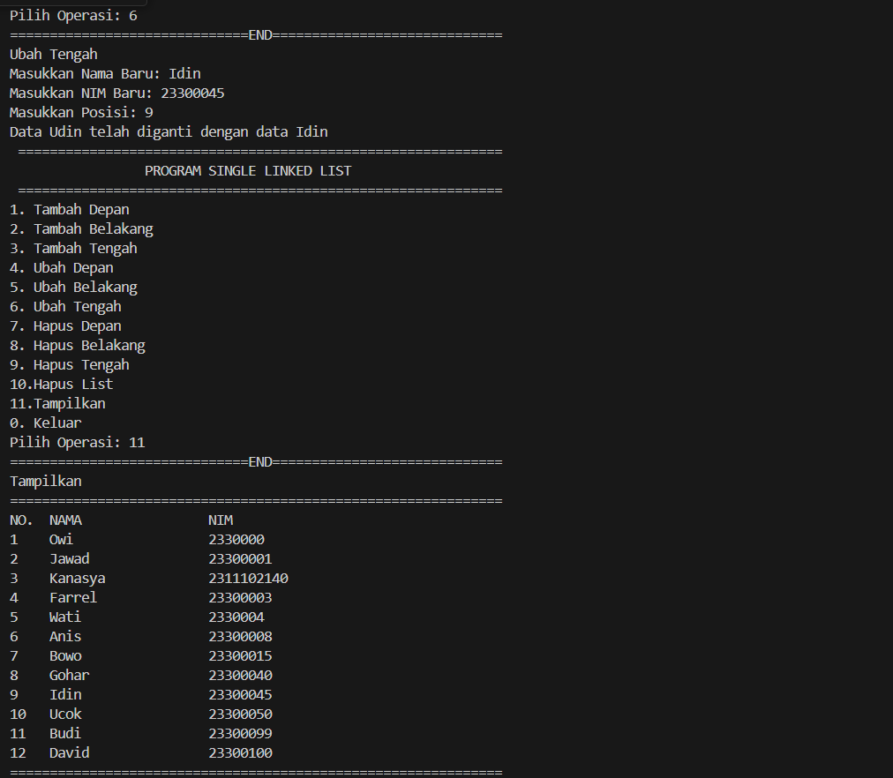

# <h1 align="center">Laporan Praktikum Modul 4 Linked List Circular dan Non Circular</h1>
<p align="center">Kanasya Abdi Aziz - 2311102140</p>

## Dasar Teori

Linked list dapat dibagi menjadi dua jenis, yaitu linked list circular dan non-circular.

1. Linked list non-circular

Pada linked list non-circular, node terakhir tidak menunjuk pada simpul pertama. Artinya, linked list ini memiliki simpul terakhir yang menunjuk ke null atau tidak menunjuk ke simpul mana pun. Dalam linked list non-circular, traversal atau penelusuran dari awal hingga akhir dapat dilakukan dengan mudah dengan mengikuti alamat setiap node.

2. Linked list circular

Pada linked list circular, simpul terakhir menunjuk pada simpul pertama. Artinya, linked list ini membentuk sebuah lingkaran, dan traversal dapat dimulai dari mana saja dalam linked list ini. Linked list circular memiliki kelebihan yaitu memungkinkan untuk melakukan traversal dari mana saja dan tidak memerlukan operasi tambahan untuk mengembalikan pointer ke simpul awal.

Dalam implementasinya, linked list circular dan non-circular memiliki beberapa perbedaan. Salah satunya adalah pada operasi penambahan atau penghapusan node, dimana linked list circular memerlukan operasi tambahan untuk mengubah pointer pada simpul terakhir agar menunjuk pada simpul pertama. Sedangkan linked list non-circular tidak memerlukan operasi tersebut karena simpul terakhirnya tidak menunjuk ke simpul pertama.

## Guided 

### 1. [Program Linked List Non Circular]

```C++
#include <iostream>
using namespace std;
/// PROGRAM SINGLE LINKED LIST NON-CIRCULAR
// Deklarasi Struct Node
struct Node
{
    int data;
    Node *next;
};
Node *head;
Node *tail;
// Inisialisasi Node
void init()
{
    head = NULL;
    tail = NULL;
}
// Pengecekan
bool isEmpty()
{
    if (head == NULL)
        return true;
    else
        return false;
}
// Tambah Depan
void insertDepan(int nilai)
{
    // Buat Node baru
    Node *baru = new Node;
    baru->data = nilai;
    baru->next = NULL;
    if (isEmpty() == true)
    {
        head = tail = baru;
        tail->next = NULL;
    }
    else
    {
        baru->next = head;
        head = baru;
    }
}
// Tambah Belakang
void insertBelakang(int nilai)
{
    // Buat Node baru
    Node *baru = new Node;
    baru->data = nilai;
    baru->next = NULL;
    if (isEmpty() == true)
    {
        head = tail = baru;
        tail->next = NULL;
    }
    else
    {
        tail->next = baru;
        tail = baru;
    }
}
// Hitung Jumlah List
int hitungList()
{
    Node *hitung;
    hitung = head;
    int jumlah = 0;
    while (hitung != NULL)
    {
        jumlah++;
        hitung = hitung->next;
    }
    return jumlah;
}
// Tambah Tengah
void insertTengah(int data, int posisi)
{
    if (posisi < 1 || posisi > hitungList())
    {
        cout << "Posisi diluar jangkauan" << endl;
    }
    else if (posisi == 1)
    {
        cout << "Posisi bukan posisi tengah" << endl;
    }
    else
    {
        Node *baru, *bantu;
        baru = new Node();
        baru->data = data;
        // tranversing
        bantu = head;
        int nomor = 1;
        while (nomor < posisi - 1)
        {
            bantu = bantu->next;
            nomor++;
        }
        baru->next = bantu->next;
        bantu->next = baru;
    }
}
// Hapus Depan
void hapusDepan()
{
    Node *hapus;
    if (isEmpty() == false)
    {
        if (head->next != NULL)
        {
            hapus = head;
            head = head->next;
            delete hapus;
        }
        else
        {
            head = tail = NULL;
        }
    }
    else
    {
        cout << "List Kosong" << endl;
    }
}
// Hapus Belakang
void hapusBelakang()
{
    Node *hapus;
    Node *bantu;
    if (isEmpty() == false)
    {
        if (head != tail)
        {
            hapus = tail;
            bantu = head;
            while (bantu->next != tail)
            {
                bantu = bantu->next;
            }
            tail = bantu;
            tail->next = NULL;
            delete hapus;
        }
        else
        {
            head = tail = NULL;
        }
    }
    else
    {
        cout << "List kosong!" << endl;
    }
}
// Hapus Tengah
void hapusTengah(int posisi)
{
    Node *bantu, *hapus, *sebelum;
    if (posisi < 1 || posisi > hitungList())
    {
        cout << "Posisi di luar jangkauan" << endl;
    }
    else if (posisi == 1)
    {
        cout << "Posisi bukan posisi tengah" << endl;
    }
    else
    {
        int nomor = 1;
        bantu = head;
        while (nomor <= posisi)
        {
            if (nomor == posisi - 1)
            {
                sebelum = bantu;
            }
            if (nomor == posisi)
            {
                hapus = bantu;
            }
            bantu = bantu->next;
            nomor++;
        }
        sebelum->next = bantu;
        delete hapus;
    }
}
// Ubah Depan
void ubahDepan(int data)
{
    if (isEmpty() == 0)
    {
        head->data = data;
    }
    else
    {
        cout << "List masih kosong!" << endl;
    }
}
// Ubah Tengah
void ubahTengah(int data, int posisi)
{
    Node *bantu;
    if (isEmpty() == 0)
    {
        if (posisi < 1 || posisi > hitungList())
        {
            cout << "Posisi di luar jangkauan" << endl;
        }
        else if (posisi == 1)
        {
        }
        else
        {
            cout << "Posisi bukan posisi tengah" << endl;
            bantu = head;
            int nomor = 1;
            while (nomor < posisi)
            {
                bantu = bantu->next;
                nomor++;
            }
            bantu->data = data;
        }
    }
    else
    {
        cout << "List masih kosong!" << endl;
    }
}
// Ubah Belakang
void ubahBelakang(int data)
{
    if (isEmpty() == 0)
    {
        tail->data = data;
    }
    else
    {
        cout << "List masih kosong!" << endl;
    }
}
// Hapus List
void clearList()
{
    Node *bantu, *hapus;
    bantu = head;
    while (bantu != NULL)
    {
        hapus = bantu;
        bantu = bantu->next;
        delete hapus;
    }
    head = tail = NULL;
    cout << "List berhasil terhapus!" << endl;
}
// Tampilkan List
void tampil()
{
    Node *bantu;
    bantu = head;
    if (isEmpty() == false)
    {
        while (bantu != NULL)
        {
            cout << bantu->data << ends;
            bantu = bantu->next;
        }
        cout << endl;
    }
    else
    {
        cout << "List masih kosong!" << endl;
    }
}
int main()
{
    init();
    insertDepan(3);
    tampil();
    insertBelakang(5);
    tampil();
    insertDepan(2);
    tampil();
    insertDepan(1);
    tampil();
    hapusDepan();
    tampil();
    hapusBelakang();
    tampil();
    insertTengah(7, 2);
    tampil();
    hapusTengah(2);
    tampil();
    ubahDepan(1);
    tampil();
    ubahBelakang(8);
    tampil();
    ubahTengah(11, 2);
    tampil();
    return 0;
}
```
Script di atas adalah implementasi dari sebuah linked list non-circular dalam bahasa pemrograman C++. Program ini memiliki fungsi-fungsi dasar seperti penambahan elemen di depan, di belakang, atau di tengah linked list, penghapusan elemen di depan, di belakang, atau di tengah linked list, serta operasi pengubahan data pada elemen-elemen linked list. Setiap operasi dilakukan melalui fungsi-fungsi yang sesuai, dan hasilnya ditampilkan secara berurutan setelah setiap operasi dilakukan dalam fungsi main().

### 2. [Program Linked List Circular]

```C++
#include <iostream>
using namespace std;

// Deklarasi Struct Node
struct Node
{
    string data;
    Node* next;
};

Node* head, * tail, * baru, * bantu, * hapus;

void init()
{
    head = NULL;
    tail = head;
}

// Pengecekan
int isEmpty()
{
    if (head == NULL)
        return 1; // true
    else
        return 0; // false
}

// Buat Node Baru
void buatNode(string data)
{
    baru = new Node;
    baru->data = data;
    baru->next = NULL;
}

// Hitung List
int hitungList()
{
    bantu = head;
    int jumlah = 0;
    while (bantu != NULL)
    {
        jumlah++;
        bantu = bantu->next;
    }
    return jumlah;
}

// Tambah Depan
void insertDepan(string data)
{
    // Buat Node baru
    buatNode(data);

    if (isEmpty() == 1)
    {
        head = baru;
        tail = head;
        baru->next = head;
    }
    else
    {
        while (tail->next != head)
        {
            tail = tail->next;
        }
        baru->next = head;
        head = baru;
        tail->next = head;
    }
}

// Tambah Belakang
void insertBelakang(string data)
{
    // Buat Node baru
    buatNode(data);

    if (isEmpty() == 1)
    {
        head = baru;
        tail = head;
        baru->next = head;
    }
    else
    {
        while (tail->next != head)
        {
            tail = tail->next;
        }
        tail->next = baru;
        baru->next = head;
    }
}

// Tambah Tengah
void insertTengah(string data, int posisi)
{
    if (isEmpty() == 1)
    {
        head = baru;
        tail = head;
        baru->next = head;
    }
    else
    {
        baru->data = data;
        // transversing
        int nomor = 1;
        bantu = head;
        while (nomor < posisi - 1)
        {
            bantu = bantu->next;
            nomor++;
        }
        baru->next = bantu->next;
        bantu->next = baru;
    }
}

// Hapus Depan
void hapusDepan()
{
    if (isEmpty() == 0)
    {
        hapus = head;
        tail = head;
        if (hapus->next == head)
        {
            head = NULL;
            tail = NULL;
            delete hapus;
        }
        else
        {
            while (tail->next != hapus)
            {
                tail = tail->next;
            }
            head = head->next;
            tail->next = head;
            hapus->next = NULL;
            delete hapus;
        }
    }
    else
    {
        cout << "List masih kosong!" << endl;
    }
}

// Hapus Belakang
void hapusBelakang()
{
    if (isEmpty() == 0)
    {
        hapus = head;
        tail = head;
        if (hapus->next == head)
        {
            head = NULL;
            tail = NULL;
            delete hapus;
        }
        else
        {
            while (hapus->next != head)
            {
                hapus = hapus->next;
            }
            while (tail->next != hapus)
            {
                tail = tail->next;
            }
            tail->next = head;
            hapus->next = NULL;
            delete hapus;
        }
    }
    else
    {
        cout << "List masih kosong!" << endl;
    }
}

// Hapus Tengah
void hapusTengah(int posisi)
{
    if (isEmpty() == 0)
    {
        // transversing
        int nomor = 1;
        bantu = head;
        while (nomor < posisi - 1)
        {
            bantu = bantu->next;
            nomor++;
        }
        hapus = bantu->next;
        bantu->next = hapus->next;
        delete hapus;
    }
    else
    {
        cout << "List masih kosong!" << endl;
    }
}

// Hapus List
void clearList()
{
    if (head != NULL)
    {
        hapus = head->next;
        while (hapus != head)
        {
            bantu = hapus->next;
            delete hapus;
            hapus = bantu;
        }
        delete head;
        head = NULL;
    }
    cout << "List berhasil terhapus!" << endl;
}

// Tampilkan List
void tampil()
{
    if (isEmpty() == 0)
    {
        tail = head;
        do
        {
            cout << tail->data << ends;
            tail = tail->next;
        } while (tail != head);
        cout << endl;
    }
    else
    {
        cout << "List masih kosong!" << endl;
    }
}

int main()
{
    init();
    insertDepan("Ayam");
    tampil();
    insertDepan("Bebek");
    tampil();
    insertBelakang("Cicak");
    tampil();
    insertBelakang("Domba");
    tampil();
    hapusBelakang();
    tampil();
    hapusDepan();
    tampil();
    insertTengah("Sapi", 2);
    tampil();
    hapusTengah(2);
    tampil();
    return 0;
}
```
Script di atas adalah implementasi dari sebuah linked list circular dalam bahasa pemrograman C++. Program ini memiliki fungsi-fungsi dasar seperti penambahan elemen di depan, di belakang, atau di tengah linked list, penghapusan elemen di depan, di belakang, atau di tengah linked list, serta operasi penghapusan seluruh isi linked list. Setiap operasi dilakukan melalui fungsi-fungsi yang sesuai, dan hasilnya ditampilkan secara berurutan setelah setiap operasi dilakukan dalam fungsi main().

## Unguided 

### 1. [Program menu Linked List Non Circular untuk menyimpan Nama dan NIM mahasiswa, dengan menggunakan input dari user]

```C++
#include <iostream>
#include <iomanip>
#include <string>
using namespace std;
//2311102140 

struct Mahasiswa140 {
    string Nama140;
    string NIM140;
    Mahasiswa140* next;
};

class LinkedList {
private:
    Mahasiswa140* head;

public:
    LinkedList() {
        head = NULL;
    }

    void tambah_depan(string nama, string nim) {
        Mahasiswa140* new_mahasiswa = new Mahasiswa140;
        new_mahasiswa->Nama140 = nama;
        new_mahasiswa->NIM140 = nim;
        new_mahasiswa->next = head;
        head = new_mahasiswa;
    }

    void tambah_belakang(string nama, string nim) {
        Mahasiswa140* new_mahasiswa = new Mahasiswa140;
        new_mahasiswa->Nama140 = nama;
        new_mahasiswa->NIM140 = nim;
        new_mahasiswa->next = NULL;

        if (head == NULL) {
            head = new_mahasiswa;
            return;
        }

        Mahasiswa140* current = head;
        while (current->next != NULL) {
            current = current->next;
        }
        current->next = new_mahasiswa;
    }

    void tambah_tengah(int posisi, string nama, string nim) {
        if (posisi <= 1) {
            tambah_depan(nama, nim);
            return;
        }

        Mahasiswa140* new_mahasiswa = new Mahasiswa140;
        new_mahasiswa->Nama140 = nama;
        new_mahasiswa->NIM140 = nim;

        Mahasiswa140* current = head;
        for (int i = 1; i < posisi - 1 && current != NULL; i++) {
            current = current->next;
        }

        if (current != NULL) {
            new_mahasiswa->next = current->next;
            current->next = new_mahasiswa;
        } else {
            cout << "Posisi tidak valid." << endl;
        }
    }

    void hapus_belakang() {
        if (head == NULL) {
            cout << "Linked list kosong." << endl;
            return;
        }

        if (head->next == NULL) {
            delete head;
            head = NULL;
            return;
        }

        Mahasiswa140* current = head;
        while (current->next->next != NULL) {
            current = current->next;
        }

        delete current->next;
        current->next = NULL;
    }

    void hapus_tengah(int posisi) {
        if (posisi <= 1) {
            Mahasiswa140* temp = head;
            head = head->next;
            delete temp;
            return;
        }

        Mahasiswa140* current = head;
        for (int i = 1; i < posisi - 1 && current != NULL; i++) {
            current = current->next;
        }

        if (current != NULL && current->next != NULL) {
            Mahasiswa140* temp = current->next;
            current->next = temp->next;
            delete temp;
        } else {
            cout << "Posisi tidak valid." << endl;
        }
    }

    void tampilkan() {
        Mahasiswa140* current = head;
        cout << "==============================================================" << endl;
        cout << setw(5) << left << "NO." << setw(20) << left << "NAMA" << "NIM" << endl;
        int i = 1;
        while (current != NULL) {
            cout << setw(5) << left << i << setw(20) << left << current->Nama140 << current->NIM140 << endl;
            current = current->next;
            i++;
        }
        cout << "==============================================================" << endl;
    }

    void ubah_depan(string nama_baru, string nim_baru) {
        if (head == NULL) {
            cout << "Linked list kosong." << endl;
            return;
        }

        head->Nama140 = nama_baru;
        head->NIM140 = nim_baru;
        cout << "Data " << head->Nama140 << " telah diganti dengan data " << nama_baru << endl;
    }

    void ubah_belakang(string nama_baru, string nim_baru) {
    if (head == NULL) {
        cout << "Linked list kosong." << endl;
        return;
    }

    Mahasiswa140* current = head;
    Mahasiswa140* previous = NULL;
    while (current->next != NULL) {
        previous = current;
        current = current->next;
    }
    
    string nama_lama = current->Nama140;
    current->Nama140 = nama_baru;
    current->NIM140 = nim_baru;
    cout << "Data " << nama_lama << " telah diganti dengan data " << nama_baru << endl;
}


    void ubah_tengah(int posisi, string nama_baru, string nim_baru) {
    if (posisi <= 1) {
        ubah_depan(nama_baru, nim_baru);
    } else {
        Mahasiswa140* current = head;
        for (int i = 1; i < posisi && current != NULL; i++) {
            current = current->next;
        }
        if (current != NULL) {
            string nama_lama = current->Nama140;
            current->Nama140 = nama_baru;
            current->NIM140 = nim_baru;
            cout << "Data " << nama_lama << " telah diganti dengan data " << nama_baru << endl;
        } else {
            cout << "Posisi tidak valid." << endl;
        }
    }
}

    void hapus_list() {
        while (head != NULL) {
            hapus_depan();
        }
        cout << "Seluruh data mahasiswa telah dihapus." << endl;
    }

    void hapus_depan() {
        if (head != NULL) {
            Mahasiswa140* temp = head;
            head = head->next;
            delete temp;
        }
    }
};

int main() {
    LinkedList linked_list;
    int pilihan;
    string nama, nim;
    int posisi;

    do {
        cout << " =============================================================" << endl;
        cout << "                 PROGRAM SINGLE LINKED LIST                   " << endl;
        cout << " =============================================================" << endl;
        cout << setw(2) << "1. " << setw(17) << left << "Tambah Depan" << endl;
        cout << setw(2) << "2. " << setw(17) << left << "Tambah Belakang" << endl;
        cout << setw(2) << "3. " << setw(17) << left << "Tambah Tengah"<< endl;
        cout << setw(2) << "4. " << setw(17) << left << "Ubah Depan" << endl;
        cout << setw(2) << "5. " << setw(17) << left << "Ubah Belakang" << endl;
        cout << setw(2) << "6. " << setw(17) << left << "Ubah Tengah" << endl;
        cout << setw(2) << "7. " << setw(17) << left << "Hapus Depan" << endl;
        cout << setw(2) << "8. " << setw(17) << left << "Hapus Belakang" << endl;
        cout << setw(2) << "9. " << setw(17) << left << "Hapus Tengah" << endl;
        cout << setw(2) << "10." << setw(17) << left << "Hapus List" << endl;
        cout << setw(2) << "11." << setw(17) << left << "Tampilkan" << endl;
        cout << setw(2) << "0. " << setw(17) << left << "Keluar" << endl;
        cout << "Pilih Operasi: ";
        cin >> pilihan;
        cout << "==============================END=============================" << endl;

        switch (pilihan) {
            case 1:
                cout << "Tambah Depan" << endl;
                cout << "Masukkan Nama: ";
                cin >> nama;
                cout << "Masukkan NIM: ";
                cin >> nim;
                linked_list.tambah_depan(nama, nim);
                cout << "Data telah ditambahkan" << endl;
                break;
            case 2:
                cout << "Tambah Belakang" << endl;
                cout << "Masukkan Nama: ";
                cin >> nama;
                cout << "Masukkan NIM: ";
                cin >> nim;
                linked_list.tambah_belakang(nama, nim);
                cout << "Data telah ditambahkan" << endl;
                break;
            case 3:
                cout << "Tambah Tengah" << endl;
                cout << "Masukkan Nama: ";
                cin >> nama;
                cout << "Masukkan NIM: ";
                cin >> nim;
                cout << "Masukkan Posisi: ";
                cin >> posisi;
                linked_list.tambah_tengah(posisi, nama, nim);
                cout << "Data telah ditambahkan" << endl;
                break;
            case 4:
                cout << "Ubah Depan" << endl;
                cout << "Masukkan Nama Baru: ";
                cin >> nama;
                cout << "Masukkan NIM Baru: ";
                cin >> nim;
                linked_list.ubah_depan(nama, nim);
                cout << "Data telah diubah" << endl;
                break;
            case 5:
                cout << "Ubah Belakang" << endl;
                cout << "Masukkan Nama Baru: ";
                cin >> nama;
                cout << "Masukkan NIM Baru: ";
                cin >> nim;
                linked_list.ubah_belakang(nama, nim);
                break;
            case 6:
                cout << "Ubah Tengah" << endl;
                cout << "Masukkan Nama Baru: ";
                cin >> nama;
                cout << "Masukkan NIM Baru: ";
                cin >> nim;
                cout << "Masukkan Posisi: ";
                cin >> posisi;
                linked_list.ubah_tengah(posisi, nama, nim);
                break;
            case 7:
                cout << "Hapus Depan" << endl;
                linked_list.hapus_depan();
                cout << "Data depan berhasil dihapus." << endl;
                break;
            case 8:
                cout << "Hapus Belakang" << endl;
                linked_list.hapus_belakang();
                cout << "Data belakang berhasil dihapus." << endl;
                break;
            case 9:
                cout << "Hapus Tengah" << endl;
                cout << "Masukkan Posisi: ";
                cin >> posisi;
                linked_list.hapus_tengah(posisi);
                cout << "Data pada posisi " << posisi << " berhasil dihapus." << endl;
                break;
            case 10:
                cout << "Hapus List" << endl;
                linked_list.hapus_list();
                break;
            case 11:
                cout << "Tampilkan" << endl;
                linked_list.tampilkan();
                break;
            case 0:
                cout << "Keluar" << endl;
                break;
            default:
                cout << "Pilihan tidak valid, silakan coba lagi." << endl;
        }

    } while (pilihan != 0);

    cout << "==============================================================" << endl;
    cout << "                        Kanasya Abdi Aziz                     " << endl;
    cout << "==============================================================" << endl;

    return 0;
}
```
#### Output:


#### Tambah Depan


#### Tambah Belakang


#### Tambah Tengah


#### Ubah Depan


#### Ubah Belakang


#### Ubah Tengah


#### Hapus Depan


#### Hapus Belakang


#### Hapus Tengah


#### Hapus LIst


#### Menu Tampilan


Program yang telah dibuat pada Unguided1 adalah program menu untuk Linked List Non-Circular yang digunakan untuk menyimpan Nama dan NIM mahasiswa. Program tersebut memungkinkan pengguna untuk melakukan berbagai operasi dasar seperti penambahan data (di depan, di belakang, atau di tengah), penghapusan data (di depan, di belakang, atau di tengah), pengubahan data, dan menampilkan isi linked list. Pengguna dapat memilih operasi yang diinginkan melalui menu yang disediakan hingga mereka memilih untuk keluar dari program. Setiap operasi yang dipilih akan memanggil metode yang sesuai pada kelas LinkedList. Setiap node dalam linked list menyimpan informasi mengenai nama dan NIM mahasiswa serta pointer yang menunjuk ke node berikutnya.

Setiap opsi dalam menu memiliki fungsi spesifik dalam mengelola linked list:
1. tambah_depan: Menambahkan node dengan data baru di bagian depan linked list.
2. tambah_belakang: Menambahkan node dengan data baru di bagian belakang linked list.
3. tambah_tengah: Menambahkan node dengan data baru pada posisi tertentu dalam linked list.
4. hapus_depan: Menghapus node pertama dari linked list.
5. hapus_belakang: Menghapus node terakhir dari linked list.
6. hapus_tengah: Menghapus node pada posisi tertentu dalam linked list.
7. ubah_depan: Mengubah data pada node pertama dalam linked list.
8. ubah_belakang: Mengubah data pada node terakhir dalam linked list.
9. ubah_tengah: Mengubah data pada node pada posisi tertentu dalam linked list.
10. tampilkan: Menampilkan seluruh data dalam linked list.
11. hapus_list: Menghapus seluruh data dalam linked list.
Setiap opsi memberikan pengguna kemampuan untuk memanipulasi data dalam linked list sesuai dengan kebutuhan mereka.

### 2. [Setelah membuat menu tersebut, masukkan data sesuai urutan berikut, lalu tampilkan data yang telah dimasukkan. (Gunakan insert depan, belakang atau tengah)]

```C++
#include <iostream>
#include <iomanip>
#include <string>
using namespace std;
//2311102140 

struct Mahasiswa140 {
    string Nama140;
    string NIM140;
    Mahasiswa140* next;
};

class LinkedList {
private:
    Mahasiswa140* head;

public:
    LinkedList() {
        head = NULL;
    }

    void tambah_depan(string nama, string nim) {
        Mahasiswa140* new_mahasiswa = new Mahasiswa140;
        new_mahasiswa->Nama140 = nama;
        new_mahasiswa->NIM140 = nim;
        new_mahasiswa->next = head;
        head = new_mahasiswa;
    }

    void tambah_belakang(string nama, string nim) {
        Mahasiswa140* new_mahasiswa = new Mahasiswa140;
        new_mahasiswa->Nama140 = nama;
        new_mahasiswa->NIM140 = nim;
        new_mahasiswa->next = NULL;

        if (head == NULL) {
            head = new_mahasiswa;
            return;
        }

        Mahasiswa140* current = head;
        while (current->next != NULL) {
            current = current->next;
        }
        current->next = new_mahasiswa;
    }

    void tambah_tengah(int posisi, string nama, string nim) {
        if (posisi <= 1) {
            tambah_depan(nama, nim);
            return;
        }

        Mahasiswa140* new_mahasiswa = new Mahasiswa140;
        new_mahasiswa->Nama140 = nama;
        new_mahasiswa->NIM140 = nim;

        Mahasiswa140* current = head;
        for (int i = 1; i < posisi - 1 && current != NULL; i++) {
            current = current->next;
        }

        if (current != NULL) {
            new_mahasiswa->next = current->next;
            current->next = new_mahasiswa;
        } else {
            cout << "Posisi tidak valid." << endl;
        }
    }

    void hapus_belakang() {
        if (head == NULL) {
            cout << "Linked list kosong." << endl;
            return;
        }

        if (head->next == NULL) {
            delete head;
            head = NULL;
            return;
        }

        Mahasiswa140* current = head;
        while (current->next->next != NULL) {
            current = current->next;
        }

        delete current->next;
        current->next = NULL;
    }

    void hapus_tengah(int posisi) {
        if (posisi <= 1) {
            Mahasiswa140* temp = head;
            head = head->next;
            delete temp;
            return;
        }

        Mahasiswa140* current = head;
        for (int i = 1; i < posisi - 1 && current != NULL; i++) {
            current = current->next;
        }

        if (current != NULL && current->next != NULL) {
            Mahasiswa140* temp = current->next;
            current->next = temp->next;
            delete temp;
        } else {
            cout << "Posisi tidak valid." << endl;
        }
    }

    void tampilkan() {
        Mahasiswa140* current = head;
        cout << "==============================================================" << endl;
        cout << setw(5) << left << "NO." << setw(20) << left << "NAMA" << "NIM" << endl;
        int i = 1;
        while (current != NULL) {
            cout << setw(5) << left << i << setw(20) << left << current->Nama140 << current->NIM140 << endl;
            current = current->next;
            i++;
        }
        cout << "==============================================================" << endl;
    }

    void ubah_depan(string nama_baru, string nim_baru) {
        if (head == NULL) {
            cout << "Linked list kosong." << endl;
            return;
        }

        head->Nama140 = nama_baru;
        head->NIM140 = nim_baru;
        cout << "Data " << head->Nama140 << " telah diganti dengan data " << nama_baru << endl;
    }

    void ubah_belakang(string nama_baru, string nim_baru) {
    if (head == NULL) {
        cout << "Linked list kosong." << endl;
        return;
    }

    Mahasiswa140* current = head;
    Mahasiswa140* previous = NULL;
    while (current->next != NULL) {
        previous = current;
        current = current->next;
    }
    
    string nama_lama = current->Nama140;
    current->Nama140 = nama_baru;
    current->NIM140 = nim_baru;
    cout << "Data " << nama_lama << " telah diganti dengan data " << nama_baru << endl;
}


    void ubah_tengah(int posisi, string nama_baru, string nim_baru) {
    if (posisi <= 1) {
        ubah_depan(nama_baru, nim_baru);
    } else {
        Mahasiswa140* current = head;
        for (int i = 1; i < posisi && current != NULL; i++) {
            current = current->next;
        }
        if (current != NULL) {
            string nama_lama = current->Nama140;
            current->Nama140 = nama_baru;
            current->NIM140 = nim_baru;
            cout << "Data " << nama_lama << " telah diganti dengan data " << nama_baru << endl;
        } else {
            cout << "Posisi tidak valid." << endl;
        }
    }
}

    void hapus_list() {
        while (head != NULL) {
            hapus_depan();
        }
        cout << "Seluruh data mahasiswa telah dihapus." << endl;
    }

    void hapus_depan() {
        if (head != NULL) {
            Mahasiswa140* temp = head;
            head = head->next;
            delete temp;
        }
    }
};

int main() {
    LinkedList linked_list;
    int pilihan;
    string nama, nim;
    int posisi;

    do {
        cout << " =============================================================" << endl;
        cout << "                 PROGRAM SINGLE LINKED LIST                   " << endl;
        cout << " =============================================================" << endl;
        cout << setw(2) << "1. " << setw(17) << left << "Tambah Depan" << endl;
        cout << setw(2) << "2. " << setw(17) << left << "Tambah Belakang" << endl;
        cout << setw(2) << "3. " << setw(17) << left << "Tambah Tengah"<< endl;
        cout << setw(2) << "4. " << setw(17) << left << "Ubah Depan" << endl;
        cout << setw(2) << "5. " << setw(17) << left << "Ubah Belakang" << endl;
        cout << setw(2) << "6. " << setw(17) << left << "Ubah Tengah" << endl;
        cout << setw(2) << "7. " << setw(17) << left << "Hapus Depan" << endl;
        cout << setw(2) << "8. " << setw(17) << left << "Hapus Belakang" << endl;
        cout << setw(2) << "9. " << setw(17) << left << "Hapus Tengah" << endl;
        cout << setw(2) << "10." << setw(17) << left << "Hapus List" << endl;
        cout << setw(2) << "11." << setw(17) << left << "Tampilkan" << endl;
        cout << setw(2) << "0. " << setw(17) << left << "Keluar" << endl;
        cout << "Pilih Operasi: ";
        cin >> pilihan;
        cout << "==============================END=============================" << endl;

        switch (pilihan) {
            case 1:
                cout << "Tambah Depan" << endl;
                cout << "Masukkan Nama: ";
                cin >> nama;
                cout << "Masukkan NIM: ";
                cin >> nim;
                linked_list.tambah_depan(nama, nim);
                cout << "Data telah ditambahkan" << endl;
                break;
            case 2:
                cout << "Tambah Belakang" << endl;
                cout << "Masukkan Nama: ";
                cin >> nama;
                cout << "Masukkan NIM: ";
                cin >> nim;
                linked_list.tambah_belakang(nama, nim);
                cout << "Data telah ditambahkan" << endl;
                break;
            case 3:
                cout << "Tambah Tengah" << endl;
                cout << "Masukkan Nama: ";
                cin >> nama;
                cout << "Masukkan NIM: ";
                cin >> nim;
                cout << "Masukkan Posisi: ";
                cin >> posisi;
                linked_list.tambah_tengah(posisi, nama, nim);
                cout << "Data telah ditambahkan" << endl;
                break;
            case 4:
                cout << "Ubah Depan" << endl;
                cout << "Masukkan Nama Baru: ";
                cin >> nama;
                cout << "Masukkan NIM Baru: ";
                cin >> nim;
                linked_list.ubah_depan(nama, nim);
                cout << "Data telah diubah" << endl;
                break;
            case 5:
                cout << "Ubah Belakang" << endl;
                cout << "Masukkan Nama Baru: ";
                cin >> nama;
                cout << "Masukkan NIM Baru: ";
                cin >> nim;
                linked_list.ubah_belakang(nama, nim);
                break;
            case 6:
                cout << "Ubah Tengah" << endl;
                cout << "Masukkan Nama Baru: ";
                cin >> nama;
                cout << "Masukkan NIM Baru: ";
                cin >> nim;
                cout << "Masukkan Posisi: ";
                cin >> posisi;
                linked_list.ubah_tengah(posisi, nama, nim);
                break;
            case 7:
                cout << "Hapus Depan" << endl;
                linked_list.hapus_depan();
                cout << "Data depan berhasil dihapus." << endl;
                break;
            case 8:
                cout << "Hapus Belakang" << endl;
                linked_list.hapus_belakang();
                cout << "Data belakang berhasil dihapus." << endl;
                break;
            case 9:
                cout << "Hapus Tengah" << endl;
                cout << "Masukkan Posisi: ";
                cin >> posisi;
                linked_list.hapus_tengah(posisi);
                cout << "Data pada posisi " << posisi << " berhasil dihapus." << endl;
                break;
            case 10:
                cout << "Hapus List" << endl;
                linked_list.hapus_list();
                break;
            case 11:
                cout << "Tampilkan" << endl;
                linked_list.tampilkan();
                break;
            case 0:
                cout << "Keluar" << endl;
                break;
            default:
                cout << "Pilihan tidak valid, silakan coba lagi." << endl;
        }

    } while (pilihan != 0);

    cout << "==============================================================" << endl;
    cout << "                        Kanasya Abdi Aziz                     " << endl;
    cout << "==============================================================" << endl;

    return 0;
}
```
#### Output:


Setelah membuat menu, data dimasukkan sesuai urutan yang diminta dari soal Unguided2. Pertama, data dengan nama Jawad dan NIM 23300001 dimasukkan menggunakan operasi insert depan (menu nomor 4). Kemudian, data lainnya dimasukkan menggunakan operasi insert belakang (menu nomor 5). Setelah semua data lain telah dimasukkan, data dengan nama dan NIM yang diminta dari soal Unguided2 dimasukkan menggunakan operasi insert tengah (menu nomor 6). Setelah semua data dimasukkan, tampilkan data yang telah dimasukkan.

### 3. [Program Lakukan perintah dari users]

```C++
#include <iostream>
#include <iomanip>
#include <string>
using namespace std;
//2311102140 

struct Mahasiswa140 {
    string Nama140;
    string NIM140;
    Mahasiswa140* next;
};

class LinkedList {
private:
    Mahasiswa140* head;

public:
    LinkedList() {
        head = NULL;
    }

    void tambah_depan(string nama, string nim) {
        Mahasiswa140* new_mahasiswa = new Mahasiswa140;
        new_mahasiswa->Nama140 = nama;
        new_mahasiswa->NIM140 = nim;
        new_mahasiswa->next = head;
        head = new_mahasiswa;
    }

    void tambah_belakang(string nama, string nim) {
        Mahasiswa140* new_mahasiswa = new Mahasiswa140;
        new_mahasiswa->Nama140 = nama;
        new_mahasiswa->NIM140 = nim;
        new_mahasiswa->next = NULL;

        if (head == NULL) {
            head = new_mahasiswa;
            return;
        }

        Mahasiswa140* current = head;
        while (current->next != NULL) {
            current = current->next;
        }
        current->next = new_mahasiswa;
    }

    void tambah_tengah(int posisi, string nama, string nim) {
        if (posisi <= 1) {
            tambah_depan(nama, nim);
            return;
        }

        Mahasiswa140* new_mahasiswa = new Mahasiswa140;
        new_mahasiswa->Nama140 = nama;
        new_mahasiswa->NIM140 = nim;

        Mahasiswa140* current = head;
        for (int i = 1; i < posisi - 1 && current != NULL; i++) {
            current = current->next;
        }

        if (current != NULL) {
            new_mahasiswa->next = current->next;
            current->next = new_mahasiswa;
        } else {
            cout << "Posisi tidak valid." << endl;
        }
    }

    void hapus_belakang() {
        if (head == NULL) {
            cout << "Linked list kosong." << endl;
            return;
        }

        if (head->next == NULL) {
            delete head;
            head = NULL;
            return;
        }

        Mahasiswa140* current = head;
        while (current->next->next != NULL) {
            current = current->next;
        }

        delete current->next;
        current->next = NULL;
    }

    void hapus_tengah(int posisi) {
        if (posisi <= 1) {
            Mahasiswa140* temp = head;
            head = head->next;
            delete temp;
            return;
        }

        Mahasiswa140* current = head;
        for (int i = 1; i < posisi - 1 && current != NULL; i++) {
            current = current->next;
        }

        if (current != NULL && current->next != NULL) {
            Mahasiswa140* temp = current->next;
            current->next = temp->next;
            delete temp;
        } else {
            cout << "Posisi tidak valid." << endl;
        }
    }

    void tampilkan() {
        Mahasiswa140* current = head;
        cout << "==============================================================" << endl;
        cout << setw(5) << left << "NO." << setw(20) << left << "NAMA" << "NIM" << endl;
        int i = 1;
        while (current != NULL) {
            cout << setw(5) << left << i << setw(20) << left << current->Nama140 << current->NIM140 << endl;
            current = current->next;
            i++;
        }
        cout << "==============================================================" << endl;
    }

    void ubah_depan(string nama_baru, string nim_baru) {
        if (head == NULL) {
            cout << "Linked list kosong." << endl;
            return;
        }

        head->Nama140 = nama_baru;
        head->NIM140 = nim_baru;
        cout << "Data " << head->Nama140 << " telah diganti dengan data " << nama_baru << endl;
    }

    void ubah_belakang(string nama_baru, string nim_baru) {
    if (head == NULL) {
        cout << "Linked list kosong." << endl;
        return;
    }

    Mahasiswa140* current = head;
    Mahasiswa140* previous = NULL;
    while (current->next != NULL) {
        previous = current;
        current = current->next;
    }
    
    string nama_lama = current->Nama140;
    current->Nama140 = nama_baru;
    current->NIM140 = nim_baru;
    cout << "Data " << nama_lama << " telah diganti dengan data " << nama_baru << endl;
}


    void ubah_tengah(int posisi, string nama_baru, string nim_baru) {
    if (posisi <= 1) {
        ubah_depan(nama_baru, nim_baru);
    } else {
        Mahasiswa140* current = head;
        for (int i = 1; i < posisi && current != NULL; i++) {
            current = current->next;
        }
        if (current != NULL) {
            string nama_lama = current->Nama140;
            current->Nama140 = nama_baru;
            current->NIM140 = nim_baru;
            cout << "Data " << nama_lama << " telah diganti dengan data " << nama_baru << endl;
        } else {
            cout << "Posisi tidak valid." << endl;
        }
    }
}

    void hapus_list() {
        while (head != NULL) {
            hapus_depan();
        }
        cout << "Seluruh data mahasiswa telah dihapus." << endl;
    }

    void hapus_depan() {
        if (head != NULL) {
            Mahasiswa140* temp = head;
            head = head->next;
            delete temp;
        }
    }
};

int main() {
    LinkedList linked_list;
    int pilihan;
    string nama, nim;
    int posisi;

    do {
        cout << " =============================================================" << endl;
        cout << "                 PROGRAM SINGLE LINKED LIST                   " << endl;
        cout << " =============================================================" << endl;
        cout << setw(2) << "1. " << setw(17) << left << "Tambah Depan" << endl;
        cout << setw(2) << "2. " << setw(17) << left << "Tambah Belakang" << endl;
        cout << setw(2) << "3. " << setw(17) << left << "Tambah Tengah"<< endl;
        cout << setw(2) << "4. " << setw(17) << left << "Ubah Depan" << endl;
        cout << setw(2) << "5. " << setw(17) << left << "Ubah Belakang" << endl;
        cout << setw(2) << "6. " << setw(17) << left << "Ubah Tengah" << endl;
        cout << setw(2) << "7. " << setw(17) << left << "Hapus Depan" << endl;
        cout << setw(2) << "8. " << setw(17) << left << "Hapus Belakang" << endl;
        cout << setw(2) << "9. " << setw(17) << left << "Hapus Tengah" << endl;
        cout << setw(2) << "10." << setw(17) << left << "Hapus List" << endl;
        cout << setw(2) << "11." << setw(17) << left << "Tampilkan" << endl;
        cout << setw(2) << "0. " << setw(17) << left << "Keluar" << endl;
        cout << "Pilih Operasi: ";
        cin >> pilihan;
        cout << "==============================END=============================" << endl;

        switch (pilihan) {
            case 1:
                cout << "Tambah Depan" << endl;
                cout << "Masukkan Nama: ";
                cin >> nama;
                cout << "Masukkan NIM: ";
                cin >> nim;
                linked_list.tambah_depan(nama, nim);
                cout << "Data telah ditambahkan" << endl;
                break;
            case 2:
                cout << "Tambah Belakang" << endl;
                cout << "Masukkan Nama: ";
                cin >> nama;
                cout << "Masukkan NIM: ";
                cin >> nim;
                linked_list.tambah_belakang(nama, nim);
                cout << "Data telah ditambahkan" << endl;
                break;
            case 3:
                cout << "Tambah Tengah" << endl;
                cout << "Masukkan Nama: ";
                cin >> nama;
                cout << "Masukkan NIM: ";
                cin >> nim;
                cout << "Masukkan Posisi: ";
                cin >> posisi;
                linked_list.tambah_tengah(posisi, nama, nim);
                cout << "Data telah ditambahkan" << endl;
                break;
            case 4:
                cout << "Ubah Depan" << endl;
                cout << "Masukkan Nama Baru: ";
                cin >> nama;
                cout << "Masukkan NIM Baru: ";
                cin >> nim;
                linked_list.ubah_depan(nama, nim);
                cout << "Data telah diubah" << endl;
                break;
            case 5:
                cout << "Ubah Belakang" << endl;
                cout << "Masukkan Nama Baru: ";
                cin >> nama;
                cout << "Masukkan NIM Baru: ";
                cin >> nim;
                linked_list.ubah_belakang(nama, nim);
                break;
            case 6:
                cout << "Ubah Tengah" << endl;
                cout << "Masukkan Nama Baru: ";
                cin >> nama;
                cout << "Masukkan NIM Baru: ";
                cin >> nim;
                cout << "Masukkan Posisi: ";
                cin >> posisi;
                linked_list.ubah_tengah(posisi, nama, nim);
                break;
            case 7:
                cout << "Hapus Depan" << endl;
                linked_list.hapus_depan();
                cout << "Data depan berhasil dihapus." << endl;
                break;
            case 8:
                cout << "Hapus Belakang" << endl;
                linked_list.hapus_belakang();
                cout << "Data belakang berhasil dihapus." << endl;
                break;
            case 9:
                cout << "Hapus Tengah" << endl;
                cout << "Masukkan Posisi: ";
                cin >> posisi;
                linked_list.hapus_tengah(posisi);
                cout << "Data pada posisi " << posisi << " berhasil dihapus." << endl;
                break;
            case 10:
                cout << "Hapus List" << endl;
                linked_list.hapus_list();
                break;
            case 11:
                cout << "Tampilkan" << endl;
                linked_list.tampilkan();
                break;
            case 0:
                cout << "Keluar" << endl;
                break;
            default:
                cout << "Pilihan tidak valid, silakan coba lagi." << endl;
        }

    } while (pilihan != 0);

    cout << "==============================================================" << endl;
    cout << "                        Kanasya Abdi Aziz                     " << endl;
    cout << "==============================================================" << endl;

    return 0;
}
```
#### Output:

#### Tambahkan data berikut diantara Farrel dan Denis: Wati 2330004


#### Hapus data Denis


#### Tambahkan data berikut di awal: Owi 2330000


#### Tambahkan data berikut di akhir: David 23300100


#### Ubah data Udin menjadi data berikut: Idin 23300045


#### Ubah data terkahir menjadi berikut: Lucy 23300101


#### Hapus data awal


#### Ubah data awal menjadi berikut: Bagas 2330002


#### Hapus data akhir


#### Tampilkan seluruh data


Pada perintah unguided3, masih menggunakan kode yang sama dengan unguided 1 dan 2, namun ditambahkan beberapa menu baru. Menu-menu yang ditambahkan antara lain untuk menambahkan data di tengah antara Farrel dan Denis, menghapus data Denis, menambahkan data Owi di bawah data yang sudah ada, mengubah data tengah menjadi Idin dari nama Udin, mengubah data terakhir menjadi Lucy, menghapus data awal, mengubah data awal menjadi Bagas, menghapus data terakhir, dan menampilkan seluruh data menggunakan menu tampilkan. Untuk menjalankan perintah-perintah tersebut, digunakan linked list untuk menyimpan data mahasiswa. Linked list adalah struktur data yang terdiri dari simpul-simpul yang terhubung satu sama lain secara berurutan, dimana setiap simpul memiliki dua bagian utama: data (nama dan NIM mahasiswa) dan pointer yang menunjuk ke simpul berikutnya.


## Kesimpulan
 Yang terdapat dalam guided maupun unguided, merupakan implementasi dari struktur data Linked List dalam bahasa pemrograman C++. Program-program tersebut mencakup fitur dasar seperti penambahan, penghapusan, dan pengubahan data dalam Linked List, serta kemampuan untuk menampilkan isi Linked List. Program-program ini juga dilengkapi dengan menu interaktif yang memungkinkan pengguna untuk memilih operasi yang diinginkan terhadap Linked List, seperti menambah, mengubah, atau menghapus data, serta menampilkan isi Linked List. Dengan demikian, program-program tersebut dapat digunakan sebagai contoh implementasi Linked List dalam bahasa pemrograman C++ dan sebagai alat yang berguna dalam pengelolaan dan manipulasi data menggunakan struktur data Linked List.

## Referensi
[1] Anita, Sindar. STRUKTUR DATA DAN ALGORITMA DENGAN C++ : 2019
[2] Joseph Teguh Santoso., STRUKTUR DATA dan ALGORITMA (Bagian 1). Semarang: Yayasan Prima Agus Teknik, 2021.