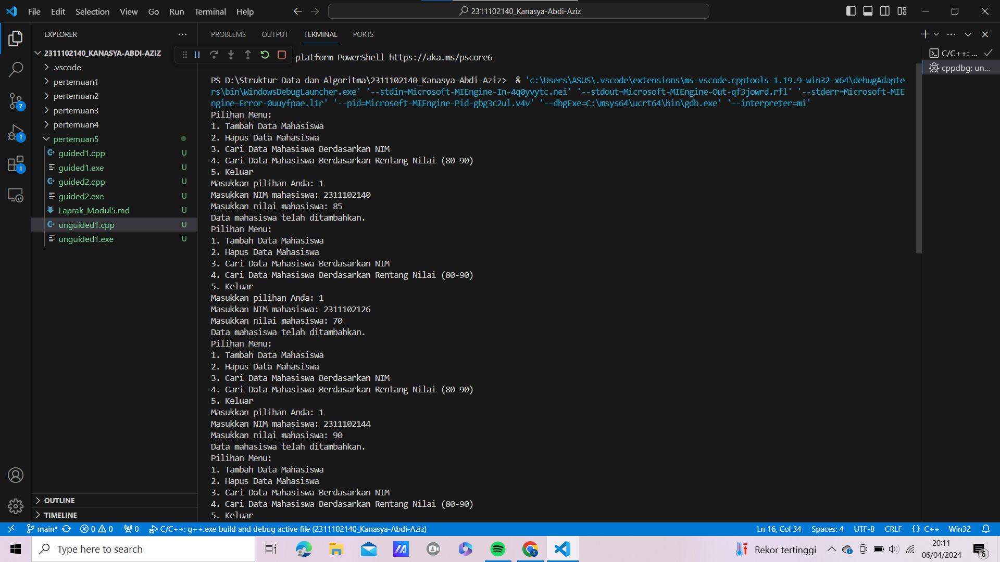
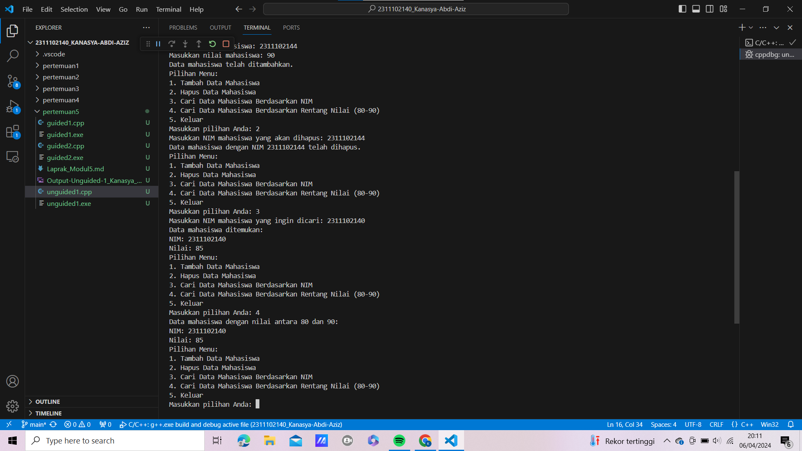

# <h1 align="center">Laporan Praktikum Modul 5 Hash Table</h1>
<p align="center">Kanasya Abdi Aziz - 2311102140</p>

## Dasar Teori

Tabel hash, juga dikenal sebagai peta hash, adalah struktur data yang digunakan untuk menyimpan catatan, di mana setiap data diakses menggunakan kunci yang dihitung oleh fungsi hash. Fungsi hash adalah algoritme yang digunakan untuk membuat indeks unik, yang kemudian digunakan untuk menemukan data yang cocok dengan kunci. Dalam tabel hash, setiap elemen disimpan dalam "ember" atau "slot" yang sesuai dengan indeks yang dikembalikan oleh fungsi hash.

Keuntungan menggunakan tabel hash adalah waktu akses yang cepat dan efisien, karena penyajian data tidak memerlukan proses iteratif atau pencarian linier ke seluruh kumpulan data. Akan tetapi penggunaan tabel hash membutuhkan alokasi memori yang cukup besar dan juga memerlukan perhatian khusus dalam merancang dan mengimplementasikan fungsi hash yang baik untuk meminimalisir kemungkinan terjadinya collision (keduanya menggunakan indeks yang sama). Tabel hash sering digunakan dalam implementasi berbagai aplikasi seperti sistem basis data, pencarian kata kunci di mesin pencari, manajemen cache, dan banyak lainnya.
Terdapat beberapa jenis fungsi hash yang dapat digunakan dalam struktur data hash table, antara lain:
1. Fungsi hash modulo, Fungsi ini menghasilkan indeks dengan menggunakan operasi modulo terhadap nilai hash dari kunci data dengan ukuran tabel hash.
2. Fungsi hash perkalian, Fungsi ini menghasilkan indeks dengan melakukan operasi perkalian antara nilai hash dari kunci data dengan sebuah konstanta dan kemudian mengambil sebagian bit dari hasil perkalian tersebut sebagai indeks.
3. Fungsi hash berbasis kunci, Fungsi ini menghasilkan nilai hash dengan melakukan operasi pada setiap karakter kunci data dan menggabungkan hasilnya.
4. Fungsi hash berbasis nilai acak, Fungsi ini menghasilkan nilai hash dengan menggunakan nilai acak sebagai input dan kemudian melakukan beberapa operasi matematika dan logika pada nilai tersebut.

Pemilihan tipe fungsi hash yang tepat tergantung pada jenis data yang akan disimpan dalam hash table, dan juga penggunaan hash table itu sendiri. Sebagai contoh, fungsi hash modulo sering digunakan untuk data numerik, sedangkan fungsi hash berbasis kunci lebih cocok untuk data teks.
Berikut adalah beberapa operasi hash table yang umum digunakan:
1. Insert, Operasi ini digunakan untuk menambahkan elemen baru ke dalam hash table dengan menyimpan kunci dan nilai data yang sesuai ke dalam bucket yang dihasilkan dari fungsi hash.
2. Get, Operasi ini digunakan untuk mengakses nilai data yang terkait dengan kunci tertentu dalam hash table. Proses ini melibatkan penghitungan fungsi hash untuk mendapatkan indeks bucket yang sesuai, dan kemudian mengambil nilai data yang tersimpan di dalam bucket tersebut.
3. Remove, Operasi ini digunakan untuk menghapus elemen dengan kunci tertentu dari hash table. Proses ini melibatkan penghitungan fungsi hash untuk mendapatkan indeks bucket yang sesuai, dan kemudian menghapus elemen yang tersimpan di dalam bucket tersebut.
4. Resize, Operasi ini digunakan untuk menyesuaikan ukuran hash table ketika jumlah elemen dalam hash table terlalu besar atau terlalu kecil. Proses ini melibatkan pembuatan hash table yang lebih besar atau lebih kecil, dan kemudian memindahkan elemen-elemen yang ada dari hash table lama ke hash table yang baru.
5. Iterate, Operasi ini digunakan untuk mengakses seluruh elemen dalam hash table secara berurutan. Proses ini melibatkan iterasi melalui setiap bucket di dalam hash table, dan kemudian mengambil nilai data dari masing-masing bucket.

Operasi-operasi di atas dapat dikombinasikan dengan operasi lain, seperti update, clear, dan lain sebagainya, tergantung pada implementasi hash table yang digunakan. Collision resolution adalah suatu metode untuk menangani masalah collision atau tumpang tindih pada hash table. Collision terjadi ketika dua atau lebih kunci data menghasilkan indeks hash yang sama dan mencoba untuk disimpan di dalam bucket yang sama. Ketika collision terjadi, hash table harus menentukan bagaimana cara menangani masalah tersebut agar tidak terjadi kehilangan data atau pencarian data yang tidak efisien.

## Guided 

### 1. [Guided 1]

```C++
#include <iostream>
using namespace std;

const int MAX_SIZE = 10;

// Fungsi hash sederhana
int hash_func(int key) {
    return key % MAX_SIZE;
}

// Struktur data untuk setiap node
struct Node {
    int key;
    int value;
    Node* next;
    Node(int key, int value) : key(key), value(value), next(nullptr) {}
};

// Class hash table
class HashTable {
private:
    Node** table;

public:
    HashTable() {
        table = new Node*[MAX_SIZE]();
    }

    ~HashTable() {
        for (int i = 0; i < MAX_SIZE; i++) {
            Node* current = table[i];
            while (current != nullptr) {
                Node* temp = current;
                current = current->next;
                delete temp;
            }
        }
        delete[] table;
    }

    // Insertion
    void insert(int key, int value) {
        int index = hash_func(key);
        Node* current = table[index];
        while (current != nullptr) {
            if (current->key == key) {
                current->value = value;
                return;
            }
            current = current->next;
        }
        Node* node = new Node(key, value);
        node->next = table[index];
        table[index] = node;
    }

    // Searching
    int get(int key) {
        int index = hash_func(key);
        Node* current = table[index];
        while (current != nullptr) {
            if (current->key == key) {
                return current->value;
            }
            current = current->next;
        }
        return -1;
    }

    // Deletion
    void remove(int key) {
        int index = hash_func(key);
        Node* current = table[index];
        Node* prev = nullptr;
        while (current != nullptr) {
            if (current->key == key) {
                if (prev == nullptr) {
                    table[index] = current->next;
                } else {
                    prev->next = current->next;
                }
                delete current;
                return;
            }
            prev = current;
            current = current->next;
        }
    }

    // Traversal
    void traverse() {
        for (int i = 0; i < MAX_SIZE; i++) {
            Node* current = table[i];
            while (current != nullptr) {
                cout << current->key << ": " << current->value << endl;
                current = current->next;
            }
        }
    }
};

int main() {
    HashTable ht;

    // Insertion
    ht.insert(1, 10);
    ht.insert(2, 20);
    ht.insert(3, 30);

    // Searching
    cout << "Get key 1: " << ht.get(1) << endl;
    cout << "Get key 4: " << ht.get(4) << endl;
    cout << "Get key 2: " << ht.get(2) << endl;
    cout << "Get key 5: " << ht.get(5) << endl;

    // Deletion
    ht.remove(4);

    // Traversal
    ht.traverse();

    return 0;
}
```
Program di atas adalah implementasi hash table sederhana dalam bahasa C++ menggunakan metode chaining untuk menangani tabrakan. Hash table digunakan untuk menyimpan pasangan kunci-nilai, di mana setiap kunci memiliki nilai yang sesuai. Fungsi hash sederhana digunakan untuk menghasilkan indeks dari kunci yang diberikan dengan menggunakan operasi modulus terhadap ukuran hash table (MAX_SIZE). Struktur data Node digunakan untuk merepresentasikan setiap elemen data dalam hash table, dengan setiap node menyimpan kunci (key) dan nilai (value) serta pointer ke node berikutnya jika terjadi tabrakan. Kelas HashTable memiliki metode untuk melakukan operasi dasar pada hash table, yaitu insertion (memasukkan pasangan kunci-nilai), searching (mencari nilai berdasarkan kunci), deletion (menghapus pasangan kunci-nilai), dan traversal (menelusuri seluruh hash table untuk menampilkan semua pasangan kunci-nilai yang disimpan). Di dalam main(), beberapa operasi tersebut dijalankan dan hasilnya ditampilkan.

### 2. [Guided 2]

```C++
#include <iostream>
#include <string>
#include <vector>
using namespace std;

const int TABLE_SIZE = 11;

class HashNode {
public:
    string name;
    string phone_number;
    HashNode(string name, string phone_number) {
        this->name = name;
        this->phone_number = phone_number;
    }
};

class HashMap {
private:
    vector<HashNode*> table[TABLE_SIZE];

public:
    int hashFunc(string key) {
        int hash_val = 0;
        for (char c : key) {
            hash_val += c;
        }
        return hash_val % TABLE_SIZE;
    }

    void insert(string name, string phone_number) {
        int hash_val = hashFunc(name);
        for (auto node : table[hash_val]) {
            if (node->name == name) {
                node->phone_number = phone_number;
                return;
            }
        }
        table[hash_val].push_back(new HashNode(name, phone_number));
    }

    void remove(string name) {
        int hash_val = hashFunc(name);
        for (auto it = table[hash_val].begin(); it != table[hash_val].end(); it++) {
            if ((*it)->name == name) {
                table[hash_val].erase(it);
                return;
            }
        }
    }

    string searchByName(string name) {
        int hash_val = hashFunc(name);
        for (auto node : table[hash_val]) {
            if (node->name == name) {
                return node->phone_number;
            }
        }
        return "";
    }

    void print() {
        for (int i = 0; i < TABLE_SIZE; i++) {
            cout << i << ": ";
            for (auto pair : table[i]) {
                if(pair != nullptr) {
                    cout << "[" << pair->name << ", " << pair->phone_number << "]";
                }
            }
            cout << endl;
        }
    }
};

int main() {
    HashMap employee_map;
    employee_map.insert("Mistah", "1234");
    employee_map.insert("Pastah", "5678");
    employee_map.insert("Ghana", "91011");

    cout << "Nomer Hp Mistah : " << employee_map.searchByName("Mistah") << endl;
    cout << "Phone Hp Pastah : " << employee_map.searchByName("Pastah") << endl;

    employee_map.remove("Mistah");
    cout << "Nomer Hp Mistah setelah dihapus : " << employee_map.searchByName("Mistah") << endl << endl;

    cout << "Hash Table : " << endl;
    employee_map.print();

    return 0;
}
```
Program di atas merupakan implementasi hash table dalam bahasa C++ menggunakan chaining untuk menangani tabrakan. Program ini mengimplementasikan kelas HashMap yang memiliki beberapa metode untuk operasi dasar pada hash table, yaitu insert (memasukkan pasangan kunci-nilai), remove (menghapus pasangan kunci-nilai), searchByName (mencari nilai berdasarkan kunci), dan print (menampilkan seluruh isi hash table). Setiap pasangan kunci-nilai disimpan dalam vektor di dalam array table, di mana kunci yang dihash akan menentukan indeksnya di dalam array tersebut. Di dalam main(), beberapa operasi tersebut dijalankan dan hasilnya ditampilkan, seperti menambahkan, mencari, dan menghapus data, serta menampilkan seluruh isi hash table.

## Unguided 

### 1. [Implementasikan hash table untuk menyimpan data mahasiswa. Setiap mahasiswa memiliki NIM dan nilai. Implementasikan fungsi untuk menambahkan data baru, menghapus data, mencari data berdasarkan NIM, dan mencari data berdasarkannilai. 
Dengan ketentuan :
a. Setiap mahasiswa memiliki NIM dan nilai.
b. Program memiliki tampilan pilihan menu berisi poin C.
c. Implementasikan fungsi untuk menambahkan data baru, menghapus data,
mencari data berdasarkan NIM, dan mencari data berdasarkan rentang nilai
(80 – 90).]

```C++
#include <iostream>
#include <vector>
#include <string>
using namespace std;

struct Mahasiswa {
    string nim140;
    float nilai140;
};

class HashTable {
private:
    static const int table_size = 10; // Ukuran hash table disetel ke 10 untuk contoh
    vector<Mahasiswa> table[table_size];

    int hash_func(string nim140) {
        int sum = 0;
        for (char c : nim140) {
            sum += int(c);
        }
        return sum % table_size;
    }

public:
    void tambah_data(Mahasiswa mahasiswa) {
        int index = hash_func(mahasiswa.nim140);
        table[index].push_back(mahasiswa);
    }

    bool hapus_data(string nim140) {
        int index = hash_func(nim140);
        for (int i = 0; i < table[index].size(); ++i) {
            if (table[index][i].nim140 == nim140) {
                table[index].erase(table[index].begin() + i);
                return true;
            }
        }
        return false;
    }

    Mahasiswa* cari_berdasarkan_nim(string nim140) {
        int index = hash_func(nim140);
        for (Mahasiswa &mahasiswa : table[index]) {
            if (mahasiswa.nim140 == nim140) {
                return &mahasiswa;
            }
        }
        return nullptr;
    }

    vector<Mahasiswa> cari_berdasarkan_rentang_nilai(float nilai_awal, float nilai_akhir) {
        vector<Mahasiswa> mahasiswa_ditemukan;
        for (int i = 0; i < table_size; ++i) {
            for (Mahasiswa &mahasiswa : table[i]) {
                if (mahasiswa.nilai140 >= nilai_awal && mahasiswa.nilai140 <= nilai_akhir) {
                    mahasiswa_ditemukan.push_back(mahasiswa);
                }
            }
        }
        return mahasiswa_ditemukan;
    }
};

// Fungsi untuk menampilkan menu
void tampilkan_menu() {
    cout << "Pilihan Menu:" << endl;
    cout << "1. Tambah Data Mahasiswa" << endl;
    cout << "2. Hapus Data Mahasiswa" << endl;
    cout << "3. Cari Data Mahasiswa Berdasarkan NIM" << endl;
    cout << "4. Cari Data Mahasiswa Berdasarkan Rentang Nilai (80-90)" << endl;
    cout << "5. Keluar" << endl;
}

int main() {
    HashTable hash_table;

    while (true) {
        tampilkan_menu();
        int pilihan;
        cout << "Masukkan pilihan Anda: ";
        cin >> pilihan;

        if (pilihan == 1) {
            Mahasiswa mahasiswa;
            cout << "Masukkan NIM mahasiswa: ";
            cin >> mahasiswa.nim140;
            cout << "Masukkan nilai mahasiswa: ";
            cin >> mahasiswa.nilai140;
            hash_table.tambah_data(mahasiswa);
            cout << "Data mahasiswa telah ditambahkan." << endl;
        } else if (pilihan == 2) {
            string nim140;
            cout << "Masukkan NIM mahasiswa yang akan dihapus: ";
            cin >> nim140;
            if (hash_table.hapus_data(nim140)) {
                cout << "Data mahasiswa dengan NIM " << nim140 << " telah dihapus." << endl;
            } else {
                cout << "Data mahasiswa dengan NIM " << nim140 << " tidak ditemukan." << endl;
            }
        } else if (pilihan == 3) {
            string nim140;
            cout << "Masukkan NIM mahasiswa yang ingin dicari: ";
            cin >> nim140;
            Mahasiswa* mahasiswa = hash_table.cari_berdasarkan_nim(nim140);
            if (mahasiswa != nullptr) {
                cout << "Data mahasiswa ditemukan:" << endl;
                cout << "NIM: " << mahasiswa->nim140 << endl;
                cout << "Nilai: " << mahasiswa->nilai140 << endl;
            } else {
                cout << "Data mahasiswa dengan NIM " << nim140 << " tidak ditemukan." << endl;
            }
        } else if (pilihan == 4) {
            vector<Mahasiswa> mahasiswa_ditemukan = hash_table.cari_berdasarkan_rentang_nilai(80, 90);
            if (!mahasiswa_ditemukan.empty()) {
                cout << "Data mahasiswa dengan nilai antara 80 dan 90:" << endl;
                for (Mahasiswa &mahasiswa : mahasiswa_ditemukan) {
                    cout << "NIM: " << mahasiswa.nim140 << endl;
                    cout << "Nilai: " << mahasiswa.nilai140 << endl;
                }
            } else {
                cout << "Tidak ada data mahasiswa dengan nilai antara 80 dan 90." << endl;
            }
        } else if (pilihan == 5) {
            cout << "Terima kasih!" << endl;
            break;
        } else {
            cout << "Pilihan tidak valid. Silakan pilih lagi." << endl;
        }
    }

    return 0;
}
```
#### Output:




Program di atas adalah implementasi hash table dalam bahasa C++ untuk menyimpan data mahasiswa. Setiap mahasiswa direpresentasikan oleh struktur Mahasiswa yang memiliki atribut NIM (nim140) dan nilai (nilai140). Implementasi hash table dilakukan menggunakan chaining untuk menangani tabrakan. Program menyediakan beberapa operasi dasar seperti menambahkan data mahasiswa, menghapus data mahasiswa berdasarkan NIM, mencari data mahasiswa berdasarkan NIM, dan mencari data mahasiswa berdasarkan rentang nilai.

Di dalam fungsi main(), program menampilkan menu pilihan kepada pengguna dan menangani input pengguna sesuai dengan pilihan yang dibuat. Operasi-operasi tersebut kemudian diimplementasikan dengan menggunakan metode yang disediakan oleh kelas HashTable. Program berjalan dalam loop hingga pengguna memilih untuk keluar (pilihan 5).


## Kesimpulan
Dari program yang telah dibuat untuk implementasi hash table dalam bahasa C++, dapat disimpulkan bahwa hash table adalah struktur data yang efisien untuk menyimpan dan mengelola data dalam aplikasi komputer. Program tersebut menunjukkan kemampuan hash table dalam menyediakan operasi pencarian, penyisipan, dan penghapusan data dengan kompleksitas waktu rata-rata yang rendah, serta kemampuan dalam menangani tabrakan menggunakan metode chaining. Dengan antarmuka yang sederhana, program tersebut juga menggambarkan aplikabilitas hash table dalam berbagai konteks pengembangan perangkat lunak dan interaksi dengan pengguna. Kesimpulan tersebut menggarisbawahi peran penting hash table dalam meningkatkan efisiensi dan kinerja aplikasi dalam menyimpan dan mengelola data.

## Referensi
[1] ACKERMAN, A. F. "Quadratic search for hash tables of size pn,,, Comm. ACM 17, 3 (March 1974), p. 164.
[2] BAYS, C "The reallocation of hash-coded tables," Comm. ACM 16, 1 (Jan. 1973), pp. 11-14.
[3] BELL, J. R. "The quadratic quotient method: a hash code eliminating secondary