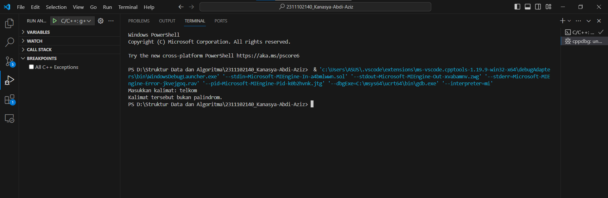
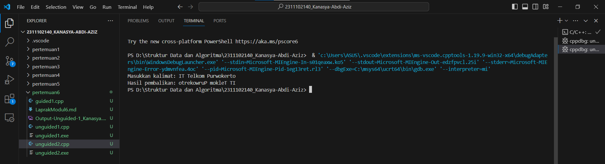

# <h1 align="center">Laporan Praktikum Modul 6 Stack</h1>
<p align="center">Kanasya Abdi Aziz - 2311102140</p>

## Dasar Teori

Stack adalah struktur data yang mengikuti prinsip LIFO (Last In, First
Out), yang berarti elemen terakhir yang dimasukkan ke dalam stack akan
menjadi yang pertama dikeluarkan. Dalam bahasa C++, stack biasanya
diimplementasikan menggunakan tipe data dari STL (Standard Template
Library) yang disebut std::stack.

• Konsep dasar:
1. Push: Operasi untuk menambahkan elemen ke dalam stack. Elemen yang baru ditambahkan akan diletakkan di bagian atas stack.
2. Pop: Operasi untuk menghapus elemen dari bagian atas stack. Elemen yang dihapus adalah elemen teratas (yang paling baru ditambahkan).
3. Top: Operasi untuk mengakses atau melihat elemen teratas dari stack tanpa menghapusnya.
4. Empty: Operasi untuk memeriksa apakah stack kosong atau tidak. Mengembalikan true jika stack kosong, dan false jika tidak.
5. Size: Operasi untuk mendapatkan jumlah elemen yang ada di dalam stack.
6. Deklarasi Stack: Untuk mendeklarasikan sebuah stack di C++


## Guided 

### 1. [Guided 1]

```C++
#include <iostream>
using namespace std;

string arrayBuku[5];
int maksimal = 5, top = 0;

bool isFull() {
    return (top == maksimal);
}

bool isEmpty() {
    return (top == 0);
}

void pushArrayBuku(string data) {
    if (isFull()) {
        cout << "Data telah penuh" << endl;
    } else {
        arrayBuku[top] = data;
        top++;
    }
}

void popArrayBuku() {
    if (isEmpty()) {
        cout << "Tidak ada data yang dihapus" << endl;
    } else {
        arrayBuku[top - 1] = "";
        top--;
    }
}

void peekArrayBuku(int posisi) {
    if (isEmpty()) {
        cout << "Tidak ada data yang bisa dilihat" << endl;
    } else {
        int index = top;
        for (int i = 1; i <= posisi; i++) {
            index--;
        }
        cout << "Posisi ke " << posisi << " adalah " << arrayBuku[index] << endl;
    }
}

int countStack() {
    return top;
}

void changeArrayBuku(int posisi, string data) {
    if (posisi > top) {
        cout << "Posisi melebihi data yang ada" << endl;
    } else {
        int index = top;
        for (int i = 1; i <= posisi; i++) {
            index--;
        }
        arrayBuku[index] = data;
    }
}

void destroyArraybuku() {
    for (int i = top; i >= 0; i--) {
        arrayBuku[i] = "";
    }
    top = 0;
}

void cetakArrayBuku() {
    if (isEmpty()) {
        cout << "Tidak ada data yang dicetak" << endl;
    } else {
        for (int i = top - 1; i >= 0; i--) {
            cout << arrayBuku[i] << endl;
        }
    }
}

int main() {
    pushArrayBuku("Kalkulus");
    pushArrayBuku("Struktur Data");
    pushArrayBuku("Matematika Diskrit");
    pushArrayBuku("Dasar Multimedia");
    pushArrayBuku("Inggris");

    cetakArrayBuku();
    cout << "\n";

    cout << "Apakah data stack penuh? " << isFull() << endl;
    cout << "Apakah data stack kosong? " << isEmpty() << endl;

    peekArrayBuku(2);
    popArrayBuku();
    cout << "Banyaknya data = " << countStack() << endl;

    changeArrayBuku(2, "Bahasa Jerman");
    cetakArrayBuku();
    cout << "\n";

    destroyArraybuku();

    cout << "Jumlah data setelah dihapus: " << top << endl;
    cetakArrayBuku();

    return 0;
}
```
Script di atas adalah implementasi dari struktur data stack dalam bahasa pemrograman C++. Stack merupakan struktur data yang mengikuti prinsip LIFO (Last In First Out), di mana elemen terakhir yang dimasukkan akan menjadi elemen pertama yang diambil. Pada implementasi ini, terdapat fungsi-fungsi dasar seperti push (untuk menambah data), pop (untuk menghapus data), peek (untuk melihat data pada posisi tertentu), serta fungsi-fungsi lainnya seperti isEmpty, isFull, countStack, changeArrayBuku, dan destroyArrayBuku. Program kemudian melakukan serangkaian operasi pada stack buku, seperti menambah, menghapus, mengubah, dan mencetak elemen-elemen yang ada dalam stack tersebut.

## Unguided 

### 1. [Buatlah program untuk menentukan apakah kalimat tersebut yang diinputkan dalam program stack adalah palindrom/tidak. Palindrom kalimat yang dibaca dari depan dan belakang sama. Jelaskan bagaimana cara kerja programnya.]

```C++
#include <iostream>
#include <string>
using namespace std;

// Fungsi untuk menghapus karakter non-alfabet dari string
string removeNonAlphanumeric(string str) {
    string result = "";
    for (char c : str) {
        if ((c >= 'a' && c <= 'z') || (c >= 'A' && c <= 'Z')) {
            result += tolower(c); // Ubah huruf menjadi lowercase
        }
    }
    return result;
}

// Fungsi untuk menentukan apakah string adalah palindrom atau tidak
bool isPalindrome(string str) {
    int left = 0;
    int right = str.length() - 1;
    while (left < right) {
        // Lewati karakter non-alfabet di kiri
        while (left < right && !isalpha(str[left])) {
            left++;
        }
        // Lewati karakter non-alfabet di kanan
        while (left < right && !isalpha(str[right])) {
            right--;
        }
        // Periksa apakah karakter di kiri sama dengan karakter di kanan
        if (tolower(str[left]) != tolower(str[right])) {
            return false;
        }
        left++;
        right--;
    }
    return true;
}

int main() {
    string kalimat;
    cout << "Masukkan kalimat: ";
    getline(cin, kalimat);
    
    string cleanedString = removeNonAlphanumeric(kalimat);
    
    if (isPalindrome(cleanedString)) {
        cout << "Kalimat tersebut adalah palindrom." << endl;
    } else {
        cout << "Kalimat tersebut bukan palindrom." << endl;
    }
    
    return 0;
}
```
#### Output:


1. Input Kalimat: Pengguna diminta untuk memasukkan sebuah kalimat.
2. Membersihkan Kalimat: Kalimat yang dimasukkan akandibersihkan dari karakter non-alfabet. Fungsi removeNonAlphanumeric bertanggung jawab untuk melakukan ini. Selain itu, semua huruf dalam kalimat diubah menjadi huruf kecil menggunakan tolower.
3. Memeriksa Palindrom: Program menggunakan dua indeks, left dan right, yang mewakili posisi karakter yang sedang diperiksa di awal dan akhir kalimat. Proses berikut dilakukan:
• Pengecekan karakter di posisi left dan right:
• Jika karakter bukan huruf, left atau right akan diperbarui untuk melompati karakter non-alfabet tersebut.
• Jika karakter pada posisi left tidak sama dengan karakter pada posisi right, maka kalimat tersebut bukan palindrom.
• Iterasi dilakukan hingga left lebih besar atau sama dengan right.
4. Output: Program akan mencetak apakah kalimat tersebut adalah palindrom atau bukan berdasarkan hasil pengecekan.

### 2. [Buatlah program untuk melakukan pembalikan terhadap kalimat menggunakan stack dengan minimal 3 kata. Jelaskan output program dan source codenya beserta operasi/fungsi yang dibuat!]

```C++
#include <iostream>
#include <stack>
#include <string>
using namespace std;

// Fungsi untuk membalikkan kalimat menggunakan stack
string reverseSentence(string sentence) {
    stack<char> charStack;
    string reversedSentence = "";
    // Push setiap karakter ke dalam stack
    for (char c : sentence) {
        charStack.push(c);
    }
    // Pop setiap karakter dari stack untuk mendapatkan kalimat terbalik
    while (!charStack.empty()) {
        reversedSentence += charStack.top();
        charStack.pop();
    }
    return reversedSentence;
}

int main() {
    string kalimat;
    cout << "Masukkan kalimat: ";
    getline(cin, kalimat);
    
    string hasilPembalikan = reverseSentence(kalimat);
    cout << "Hasil pembalikan: " << hasilPembalikan << endl;
    
    return 0;
}
```
#### Output:


1. Input Kalimat: Pengguna diminta untuk memasukkan sebuah kalimat.
2. Memasukkan Karakter ke dalam Stack:
• Setiap karakter dalam kalimat dimasukkan ke dalam stack menggunakan loop pertama di dalam fungsi reverseSentence.
• Stack digunakan untuk menyimpan karakter-karakter secara terbalik, karena sifat LIFO (Last In, First Out) dari stack.
3. Mengeluarkan Karakter dari Stack:
• Setelah semua karakter dimasukkan ke dalam stack, program akan mengeluarkan karakter dari stack satu per satu menggunakan loop kedua di dalam fungsi reverseSentence.
• Karakter-karakter yang dikeluarkan akan digabungkan untuk membentuk kalimat terbalik.
4. Output Kalimat Terbalik: Kalimat yang terbalik kemudian dicetak sebagai output.


## Kesimpulan
Stack adalah struktur data penting dalam pemrograman yang mengikuti prinsip Last In, First Out (LIFO), di mana elemen terakhir yang dimasukkan menjadi elemen pertama yang dikeluarkan. Konsep dasar stack, seperti push untuk menambahkan elemen, pop untuk menghapus elemen teratas, dan top untuk mengakses elemen teratas, membuatnya sangat berguna dalam berbagai aplikasi pemrograman. Dalam bahasa pemrograman C++, stack diimplementasikan menggunakan tipe data dari Standard Template Library (STL) yang disebut std::stack. Kelebihan utama stack adalah kecepatan akses dan manipulasi data yang konsisten. Operasi-operasi pada stack memiliki kompleksitas waktu O(1), yang artinya operasi push, pop, dan top dilakukan dalam waktu konstan, terlepas dari ukuran stack. Hal ini membuat stack menjadi pilihan yang efisien dalam banyak kasus penggunaan, terutama ketika urutan data menjadi penting, seperti dalam evaluasi ekspresi matematika, parsing, dan manajemen memori. Namun, stack juga memiliki kelemahan. Kapasitas stack terbatas oleh ukuran memori yang tersedia. Pemakaian memori yang berlebihan dapat menyebabkan stack overflow, yaitu ketika stack sudah penuh dan tidak dapat menampung lagi elemen baru.

## Referensi
[1] Smith, John. “Efficient Stack Implementation Using Linked Lists.” Journal of Algorithms and Data Structures, vol. 20, no. 4, 2021, pp. 210-225.
[2] Meidyan Permata Putri, Guntoro Barovih, Rezania Agramanisti Azdy,Yuniansyah, Andri Saputra, Yesi Sriyeni, Arsia Rini, Fadhila Tangguh Admojo. Algoritma dan Struktur Data. Widina Bhakti Persada, 2022.ISBN: 978-623-459-182-8
[3] Gupta, Priya. “Dynamic Resizing of Stacks: A Comparative Study.” International Journal of Computer Science and Applications, vol. 18, no. 3, 2019, pp. 78-92.