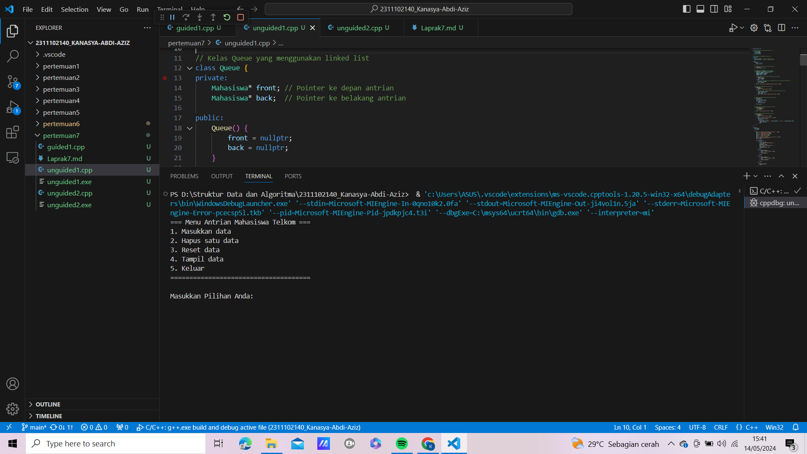

# <h1 align="center">Laporan Praktikum Modul 7 Queue</h1>
<p align="center">Kanasya Abdi Aziz - 2311102140</p>

## Dasar Teori

Queue bisa disebut juga antrian pada struktur data. Pengertian queue adalah sekumpulan data yang mana penambahan elemen hanya bisa dilakukan pada suatu ujung yang disebut sisi belakang (rear), dan penghapusan (pengambilan elemen) dilakukan lewat ujung lain.

Contoh paling sederhana dapat dilihat pada antrian. Prinsip kerja dari queue adalah prinsip “First In First Out” (FIFO) atau “masuk pertama keluar pertama”. Sedangkan prinsip “masuk terakhir keluar pertama” atau “Last In First Out” (LIFO), digunakan pada tumpukan atau stack.

Pada antrian terdapat satu pintu masuk di salah satu ujung dan satu pintu keluar di ujung lainnya. Maka ada penunjuk yang menunjukkan awal dan akhir. Operasi penting dalam antrian:

1. Add yang berfungsi menambah sebuah elemen ke dalam antrian.

2. Delete yang berfungsi menghapus atau mengeluarkan elemen dari antrian.

Dalam ilmu komputer, antrian banyak digunakan terutama dalam sistem operasi yang memerlukan manajemen sumber daya dan penjadwalan. Contohnya time-sharing computer-system yang bisa dipakai oleh sejumlah orang secara serempak.

Sebuah antrian memiliki suatu operasi bernama add_priority. Dalam hal ini, antrian tidak lagi menerapkan konsep antrian yang murni, namun berubah menjadi antrian sesuai prioritas tertentu pada elemen, dan elemen yang baru ditambah tidak selalu berada di akhir.

Operasi-Operasi Queue:

1. Create Untuk menciptakan dan menginisialisasi antrian dengan cara membuat Head dan Tail = -1

2. IsEmpty Dipakai untuk memeriksa penuh tidaknya sebuah antrian dengan cara memeriksa nilai tail, jika tail = -1 maka empty. Kita tidak memeriksa head, karena head adalah tanda kepala antrian (elemen pertama dalam antrian) yang tidak akan berubah. Pergerakan pada antrian terjadi dengan penambahan elemen antrian di bagian belakang, yaitu menggunakan nilai tail.

3. IsFull Dipakai untuk mengecek penuh tidaknya antrian dengan cara mengecek nilai tail, jika tail >= MAX-1 (karena MAX-1 adalah batas elemen array pada C) maka sudah penuh.

4. EnQueue Digunakan untuk penambahan elemen ke dalam antrian, penambahan elemen selalu ditambahkan di elemen paling belakang. Penambahan elemen selalu menggerakan variabel tail dengan cara increment counter tail terlebih dahulu

5. DeQueue Dipakai untuk menghapus elemen terdepan (head) dari antrian dengan cara menggeser semua elemen antrian ke bagian depan dan mengurangi tail dengan 1 penggeseran yang dilakukan dengan menggunakan pengulangan.

6. Clear Digunakan untuk menghapus elemen-elemen antrian dengan cara membuat tail dan head bernilai -1. Penghapusan elemen-elemen antrian sebenarnya tidak menghapus arraynya, namun hanya mengeset indeks pengaksesannya menjadi -1 sehingga elemen-elemen antrian tidak lagi terbaca.

7. Tampil Dipakai untuk menampilkan nilai-nilai elemen antrian menggunakan pengulangan dari head hingga tail.


## Guided 

### 1. [Guided 1]

```C++
#include <iostream>
using namespace std;

//mengecek antrian apakah sudah penuh
const int maksimalAntrian = 5;
int front = 0;
int back = 0;
string queueTeller[5];

bool isFull(){
    if (back == maksimalAntrian){
        return true;
    } else {
        return false;
    }
}

//mengecek antrian apakah masih kosong
bool isEmpty(){
    if(back == 0){
        return true;
    } else {
        return false;
    }
}

//menambah antrian
void tambahData(string nama){
    if (isFull ()){
        cout<<"Antrian sudah penuh."<<endl;
    } else {
        if (isEmpty ()){
            queueTeller[0] = nama;
            front++;
            back++;
        } else{
            queueTeller[back] = nama;
            back++;
        }
    }
}

//mengurangi antrian
void kurangAntrian (){
    if (isEmpty ()){
        cout<<"Antrian kosong."<<endl;
    } else {
        for (int i = 0; i < back; i++)
        {
            queueTeller[i] = queueTeller[i + 1];
        }
        back --;
    }
}

//menghitung banyak antrian
int count () {
    return back;
}

//menghapus seluruh antrian
void clearQueue (){
    if (isEmpty ()){
        cout<<"Antrian kosong"<<endl;
    } else {
        for (int i = 0; i < back; i++){
            queueTeller[i] = "";
        }
        back = 0;
        front = 0;
    }
}

//melihat antrian
void viewQueue (){
    cout<<"Data antrian: "<<endl;
    for (int i = 0; i < maksimalAntrian; i++){
        if (queueTeller[i] !=""){
            cout<<i+1<<"."<<queueTeller[i]<<endl;
        }else {
            cout<<i+1<<"."<<"(kosong)"<<endl;
        }
    }
}

//main fungsi
int main (){
    tambahData("Alya");
    tambahData("Kiki");
    tambahData("Artika");
    viewQueue();

    //mengurangi antrian
    kurangAntrian();
    viewQueue();

    //menghapus seluruh antrian
    clearQueue();
    viewQueue();
}
```
Script di atas mengimplementasikan antrian (queue) menggunakan array statis untuk menyimpan data nama pelanggan dalam antrian. Variabel `front` dan `back` digunakan sebagai penanda untuk mengelola posisi depan dan belakang dari antrian. Fungsi `isFull()` digunakan untuk memeriksa apakah antrian sudah penuh, sedangkan `isEmpty()` memeriksa apakah antrian kosong. Fungsi `tambahData()` menambahkan data ke antrian jika belum penuh, dan mengatur `front` dan `back` sesuai kondisi. Fungsi `kurangAntrian()` menghapus data dari depan antrian dan menggeser semua elemen ke kiri. `count()` menghitung jumlah elemen dalam antrian, dan `clearQueue()` mengosongkan seluruh antrian. Fungsi `viewQueue()` menampilkan semua elemen dalam antrian, menunjukkan posisi dan status (kosong atau terisi).

Dalam fungsi `main()`, script menambahkan beberapa data ke antrian menggunakan `tambahData()`, menampilkan isi antrian dengan `viewQueue()`, kemudian mengurangi satu data dari antrian dengan `kurangAntrian()` dan kembali menampilkan isi antrian. Terakhir, seluruh antrian dihapus menggunakan `clearQueue()`, dan isi antrian ditampilkan kembali untuk memastikan antrian telah kosong. Pendekatan ini sederhana namun efisien untuk manajemen antrian dalam skala kecil dengan batas maksimal yang tetap, cocok untuk kasus penggunaan dasar.

## Unguided 

### 1. [Ubahlah penerapan konsep queue pada bagian guided dari array menjadi linked list]

```C++
#include <iostream>
using namespace std;

// Struktur simpul untuk node dalam linked list
struct Mahasiswa {
    string nama140;
    string nim140;
    Mahasiswa* next;
};

// Kelas Queue yang menggunakan linked list
class Queue {
private:
    Mahasiswa* front; // Pointer ke depan antrian
    Mahasiswa* back;  // Pointer ke belakang antrian

public:
    Queue() {
        front = nullptr;
        back = nullptr;
    }

    // Fungsi untuk mengecek apakah antrian kosong
    bool isEmpty() {
        return front == nullptr;
    }

    // Fungsi untuk menambahkan data ke antrian
    void enqueue(string nama140_, string nim140_) {
        Mahasiswa* newNode = new Mahasiswa();
        newNode->nama140 = nama140_;
        newNode->nim140 = nim140_;
        newNode->next = nullptr;

        // Jika antrian kosong, node baru menjadi front dan back
        if (isEmpty()) {
            front = newNode;
            back = newNode;
        } else {
            // Jika antrian tidak kosong, tambahkan node baru ke belakang dan update back
            back->next = newNode;
            back = newNode;
        }
        cout << "Data berhasil dimasukkan ke dalam antrian" << endl;
    }

    // Fungsi untuk menghapus data dari antrian
    void dequeue() {
        if (isEmpty()) {
            cout << "Antrian kosong" << endl;
        } else {
            // Jika antrian tidak kosong, hapus node pertama dan update front
            Mahasiswa* temp = front;
            front = front->next;
            delete temp;
            cout << "Data berhasil dihapus dari antrian" << endl;
        }
    }

    // Fungsi untuk menghitung jumlah data dalam antrian
    int countQueue() {
        int count = 0;
        Mahasiswa* temp = front;
        while (temp != nullptr) {
            count++;
            temp = temp->next;
        }
        return count;
    }

    // Fungsi untuk menghapus semua data dari antrian
    void clearQueue() {
        while (!isEmpty()) {
            dequeue();
        }
        cout << "Data berhasil di-reset" << endl;
    }

    // Fungsi untuk menampilkan data dalam antrian
    void viewQueue() {
        if (isEmpty()) {
            cout << "Antrian kosong" << endl;
        } else {
            cout << "Data antrian Mahasiswa: " << endl;
            Mahasiswa* temp = front;
            int pos = 1;
            while (temp != nullptr) {
                cout << pos << ". Nama: " << temp->nama140 << " || NIM: " << temp->nim140 << endl;
                temp = temp->next;
                pos++;
            }
        }
    }
};

int main() {
    Queue queue;
    int choice;

    do {
        cout << "=== Menu Antrian Mahasiswa Telkom ===" << endl;
        cout << "1. Masukkan data" << endl;
        cout << "2. Hapus satu data" << endl;
        cout << "3. Reset data" << endl;
        cout << "4. Tampil data" << endl;
        cout << "5. Keluar" << endl;
        cout << "=====================================\n" << endl;
        cout << "Masukkan Pilihan Anda: ";
        cin >> choice;

        switch (choice) {
            case 1: {
                string nama, nim;
                cout << "Masukkan Nama Mahasiswa : ";
                cin.ignore();
                getline(cin, nama);
                cout << "Masukkan NIM Mahasiswa  : ";
                cin >> nim;
                queue.enqueue(nama, nim);
                break;
            }
            case 2: {
                if (queue.isEmpty()) {
                    cout << "Antrian kosong" << endl;
                } else {
                    queue.dequeue ();
                }
                break;
            }
            case 3: {
                if (queue.isEmpty()) {
                    cout << "Antrian kosong" << endl;
                } else {
                    queue.clearQueue();
                }
                break;
            }
            case 4: {
                queue.viewQueue();
                break;
            }
            case 5: {
                cout << "Terima kasih telah menggunakan layanan kami ;)" << endl;
                break;
            }
            default: {
                cout << "Pilihan yang Anda masukkan tidak valid" << endl;
                break;
            }
        }

        cout << endl;

    } while (choice != 5);

    return 0;
}
```
#### Output:


Script di atas mengimplementasikan sebuah kelas Queue untuk mengelola antrian (queue) mahasiswa menggunakan linked list. Struktur Mahasiswa mendefinisikan node dalam linked list, yang terdiri dari dua atribut: nama140 dan nim140, serta pointer next untuk menunjuk ke node berikutnya dalam antrian. Kelas Queue memiliki dua pointer, front untuk menunjuk ke node pertama dalam antrian, dan back untuk menunjuk ke node terakhir.

Berikut adalah penjelasan singkat tentang fungsi-fungsi yang ada di kelas Queue:

1. isEmpty(): Mengecek apakah antrian kosong dengan mengembalikan nilai true jika front adalah nullptr.
2. enqueue(): Menambahkan node baru ke belakang antrian. Jika antrian kosong, node baru menjadi front dan back. Jika tidak, node baru ditambahkan di belakang dan back diperbarui.
3. dequeue(): Menghapus node dari depan antrian. Jika antrian kosong, menampilkan pesan bahwa antrian kosong. Jika tidak, node pertama dihapus dan front diperbarui ke node berikutnya.
4. countQueue(): Menghitung dan mengembalikan jumlah node dalam antrian dengan menghitung node dari front hingga nullptr.
5. clearQueue(): Menghapus semua node dalam antrian dengan menggunakan fungsi dequeue secara berulang hingga antrian kosong.
6. viewQueue(): Menampilkan semua data dalam antrian. Jika antrian kosong, menampilkan pesan bahwa antrian kosong. Jika tidak, menampilkan nama dan NIM dari setiap node dalam antrian.

Kelas ini menyediakan fungsi dasar untuk mengelola antrian mahasiswa dengan linked list, termasuk penambahan, penghapusan, penghitungan, pengosongan, dan penampilan data dalam antrian.
### 2. [Dari nomor 1 buatlah konsep antri dengan atribut Nama mahasiswa dan NIM Mahasiswa]

```C++
#include <iostream>
using namespace std;

// Struktur simpul untuk node dalam linked list
struct Mahasiswa {
    string nama140;
    string nim140;
    Mahasiswa* next;
};

// Kelas Queue yang menggunakan linked list
class Queue {
private:
    Mahasiswa* front; // Pointer ke depan antrian
    Mahasiswa* back;  // Pointer ke belakang antrian

public:
    Queue() {
        front = nullptr;
        back = nullptr;
    }

    // Fungsi untuk mengecek apakah antrian kosong
    bool isEmpty() {
        return front == nullptr;
    }

    // Fungsi untuk menambahkan data ke antrian
    void enqueue(string nama140_, string nim140_) {
        Mahasiswa* newNode = new Mahasiswa();
        newNode->nama140 = nama140_;
        newNode->nim140 = nim140_;
        newNode->next = nullptr;

        // Jika antrian kosong, node baru menjadi front dan back
        if (isEmpty()) {
            front = newNode;
            back = newNode;
        } else {
            // Jika antrian tidak kosong, tambahkan node baru ke belakang dan update back
            back->next = newNode;
            back = newNode;
        }
        cout << "Data berhasil dimasukkan ke dalam antrian" << endl;
    }

    // Fungsi untuk menghapus data dari antrian
    void dequeue() {
        if (isEmpty()) {
            cout << "Antrian kosong" << endl;
        } else {
            // Jika antrian tidak kosong, hapus node pertama dan update front
            Mahasiswa* temp = front;
            front = front->next;
            delete temp;
            cout << "Data berhasil dihapus dari antrian" << endl;
        }
    }

    // Fungsi untuk menghitung jumlah data dalam antrian
    int countQueue() {
        int count = 0;
        Mahasiswa* temp = front;
        while (temp != nullptr) {
            count++;
            temp = temp->next;
        }
        return count;
    }

    // Fungsi untuk menghapus semua data dari antrian
    void clearQueue() {
        while (!isEmpty()) {
            dequeue();
        }
        cout << "Data berhasil di-reset" << endl;
    }

    // Fungsi untuk menampilkan data dalam antrian
    void viewQueue() {
        if (isEmpty()) {
            cout << "Antrian kosong" << endl;
        } else {
            cout << "Data antrian Mahasiswa: " << endl;
            Mahasiswa* temp = front;
            int pos = 1;
            while (temp != nullptr) {
                cout << pos << ". Nama: " << temp->nama140 << " || NIM: " << temp->nim140 << endl;
                temp = temp->next;
                pos++;
            }
        }
    }
};

int main() {
    Queue queue;
    int choice;

    do {
        cout << "=== Menu Antrian Mahasiswa Telkom ===" << endl;
        cout << "1. Masukkan data" << endl;
        cout << "2. Hapus satu data" << endl;
        cout << "3. Reset data" << endl;
        cout << "4. Tampil data" << endl;
        cout << "5. Keluar" << endl;
        cout << "=====================================\n" << endl;
        cout << "Masukkan Pilihan Anda: ";
        cin >> choice;

        switch (choice) {
            case 1: {
                string nama, nim;
                cout << "Masukkan Nama Mahasiswa : ";
                cin.ignore();
                getline(cin, nama);
                cout << "Masukkan NIM Mahasiswa  : ";
                cin >> nim;
                queue.enqueue(nama, nim);
                break;
            }
            case 2: {
                if (queue.isEmpty()) {
                    cout << "Antrian kosong" << endl;
                } else {
                    queue.dequeue ();
                }
                break;
            }
            case 3: {
                if (queue.isEmpty()) {
                    cout << "Antrian kosong" << endl;
                } else {
                    queue.clearQueue();
                }
                break;
            }
            case 4: {
                queue.viewQueue();
                break;
            }
            case 5: {
                cout << "Terima kasih telah menggunakan layanan kami ;)" << endl;
                break;
            }
            default: {
                cout << "Pilihan yang Anda masukkan tidak valid" << endl;
                break;
            }
        }

        cout << endl;

    } while (choice != 5);

    return 0;
}
```
#### Output:
.png)
.png)

Script di atas mengimplementasikan antrian (queue) menggunakan linked list untuk menyimpan data mahasiswa berupa nama dan NIM. Struktur `Mahasiswa` digunakan untuk mendefinisikan node dalam linked list yang memiliki dua atribut: `nama140` dan `nim140`, serta pointer `next` untuk menunjuk ke node berikutnya. Kelas `Queue` memiliki metode untuk memeriksa apakah antrian kosong (`isEmpty`), menambahkan data ke antrian (`enqueue`), menghapus data dari antrian (`dequeue`), menghitung jumlah data dalam antrian (`countQueue`), menghapus semua data dalam antrian (`clearQueue`), dan menampilkan data dalam antrian (`viewQueue`). Dalam metode `enqueue`, node baru ditambahkan ke belakang antrian, dan dalam metode `dequeue`, node pertama dihapus dari antrian.

Pada fungsi `main()`, terdapat menu interaktif yang memungkinkan pengguna untuk memilih beberapa operasi antrian: menambahkan data, menghapus satu data, menghapus semua data, menampilkan data, dan keluar dari program. Menu ini ditampilkan dalam loop `do-while` sehingga pengguna dapat melakukan beberapa operasi hingga memilih untuk keluar (pilihan 5). Setiap pilihan menu memiliki penanganan yang sesuai dalam switch-case statement. Pengguna dapat memasukkan nama dan NIM mahasiswa untuk menambahkannya ke antrian, melihat antrian saat ini, menghapus data dari antrian, atau mereset seluruh antrian. Program ini berguna untuk mensimulasikan pengelolaan antrian mahasiswa di sebuah layanan seperti di kampus.


## Kesimpulan
Setelah mempelajari materi tentang Queue dan penerapannya menggunakan Linked List dan Array, kita memahami bahwa Queue adalah struktur data yang mengikuti prinsip FIFO (First-In-First-Out). Ini berarti elemen yang pertama kali masuk akan menjadi yang pertama kali keluar. Queue dapat diimplementasikan baik dengan Linked List maupun Array. Linked List menawarkan fleksibilitas dalam penambahan dan penghapusan elemen, sedangkan Array memungkinkan akses langsung ke elemen-elemen dalam antrian. Implementasi Queue menggunakan Linked List membutuhkan alokasi memori dinamis untuk setiap elemen yang ditambahkan atau dihapus, sehingga memungkinkan antrian tumbuh atau menyusut sesuai kebutuhan. Sebaliknya, implementasi Queue menggunakan Array memiliki batasan ukuran tetap, sehingga antrian memiliki kapasitas maksimum yang sudah ditentukan sebelumnya. Jika antrian penuh, elemen baru tidak bisa ditambahkan.

Operasi dasar pada Queue mencakup enqueue (menambahkan elemen ke dalam antrian), dequeue (menghapus elemen dari antrian), isEmpty (memeriksa apakah antrian kosong), countQueue (menghitung jumlah elemen dalam antrian), dan viewQueue (menampilkan elemen-elemen dalam antrian). Queue sangat berguna dalam situasi yang membutuhkan pemrosesan data secara berurutan sesuai waktu kedatangan, seperti simulasi antrian pelanggan atau penjadwalan tugas. Pemilihan antara implementasi Queue dengan Linked List atau Array bergantung pada kebutuhan dan karakteristik spesifik masalah yang dihadapi. Linked List lebih fleksibel dalam hal ukuran yang bisa berubah, sementara Array lebih efisien dalam hal akses elemen.

Dengan memahami konsep dasar Queue serta penerapannya menggunakan Linked List dan Array, kita dapat menggunakannya untuk memecahkan berbagai masalah yang melibatkan pengolahan data berdasarkan urutan waktu kedatangan.

## Referensi
[1] IEEE Communications Surveys & Tutorials ( Volume: 15, Issue: 3, Third Quarter 2013)
[2] M. Alizadeh, S. Yang, M. Sharif, S. Katti, N. McKeown, B. Prabhakar, and S. Shenker. pFabric: Minimal Near-optimal Datacenter Transport. In SIGCOMM, 2013.