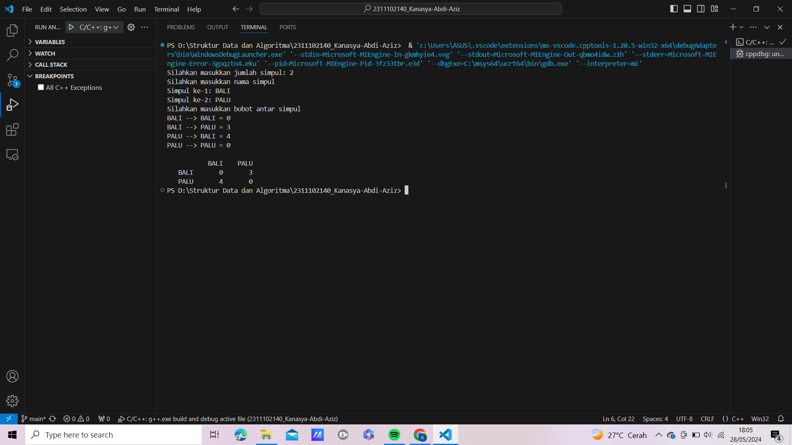

# <h1 align="center">Laporan Praktikum Modul 9 Graph dan Tree</h1>
<p align="center">Kanasya Abdi Aziz - 2311102140</p>

## Dasar Teori

Graph dan tree adalah dua konsep yang berbeda dalam ilmu komputer. Berikut adalah penjelasan singkat mengenai keduanya:

Graph

Graph adalah struktur data yang terdiri dari simpul (node) dan busur (edge) yang menghubungkan simpul-simpul tersebut. Graph digunakan untuk merepresentasikan hubungan antara objek atau entitas dalam suatu sistem. Graph dapat digunakan untuk memodelkan berbagai macam masalah, seperti jaringan sosial, rute perjalanan, dan sebagainya.

Representasi graph dengan linked list adalah salah satu cara merepresentasikan graf dalam bentuk struktur data linked list. Pada representasi ini, setiap simpul pada graf direpresentasikan sebagai node pada linked list, dan setiap busur pada graf direpresentasikan sebagai elemen pada linked list tersebut. Dalam representasi ini, setiap node pada linked list memiliki dua bagian, yaitu data dan pointer ke node berikutnya pada linked list. Data pada setiap node merepresentasikan simpul pada graf, sedangkan pointer pada setiap node merepresentasikan busur pada graf yang terhubung dengan simpul tersebut. Representasi graph dengan linked list dapat digunakan untuk merepresentasikan graf berarah maupun tidak berarah, serta graf berbobot maupun tidak berbobot. Representasi ini memiliki keuntungan dalam penggunaan memori, karena hanya menyimpan busur yang ada pada graf, sehingga lebih efisien untuk graf yang sangat besar. Namun, representasi ini memiliki kelemahan dalam akses data, karena pencarian data pada linked list membutuhkan waktu yang lebih lama dibandingkan dengan representasi graph lainnya seperti adjacency matrix.

Tree

Tree adalah struktur data khusus dari graph yang tidak memiliki siklus (cycle). Tree terdiri dari simpul-simpul yang terhubung dengan busur-busur, namun tidak ada dua simpul yang terhubung dengan lebih dari satu busur. Tree digunakan untuk merepresentasikan hierarki, seperti struktur direktori pada sistem operasi, atau hubungan antara kelas dalam suatu program.

Operasi pemrograman pada tree meliputi beberapa hal, antara lain:

1. Traverse: operasi kunjungan terhadap node-node dalam pohon. Terdapat beberapa jenis traverse, seperti in-order, pre-order, dan post-order traverse. In-order traverse dilakukan dengan cara mengunjungi simpul kiri, mencetak simpul yang dikunjungi, dan mengunjungi simpul kanan. Pre-order traverse dilakukan dengan cara mencetak simpul yang dikunjungi, mengunjungi simpul kiri, dan mengunjungi simpul kanan. Post-order traverse dilakukan dengan cara mengunjungi simpul kiri, mengunjungi simpul kanan, dan mencetak simpul yang dikunjungi.

2. Insert: operasi untuk menambahkan simpul baru ke dalam tree. Pada operasi ini, simpul baru ditempatkan pada posisi yang tepat sesuai dengan aturan tree.

3. Delete: operasi untuk menghapus simpul dari tree. Pada operasi ini, simpul yang dihapus harus diganti dengan simpul lain yang sesuai dengan aturan tree.

4. Search: operasi untuk mencari simpul pada tree. Pada operasi ini, simpul dicari dengan cara menelusuri tree dari simpul root hingga simpul yang dicari ditemukan.

5. Balance: operasi untuk menjaga keseimbangan tree. Pada operasi ini, tree diubah sehingga memiliki ketinggian yang seimbang dan meminimalkan waktu akses data.


## Guided 

### 1. [Guided 1]

```C++
#include <iostream>
#include <iomanip>

using namespace std;
string simpul[7] = {
    "Ciamis", "Bandung", "Bekasi", "Tasikmalaya", "Cianjur", "Purwokerto", "Yogyakarta"
};
int busur[7][7] = {
    {0, 7, 8, 0, 0, 0, 0},
    {0, 0, 5, 0, 0, 15, 0},
    {0, 6, 0, 0, 5, 0, 0},
    {0, 5, 0, 0, 2, 4, 0},
    {23, 0, 0, 10, 0, 0, 8},
    {0, 0, 0, 0, 7, 0, 3},
    {0, 0, 0, 0, 9, 4, 0}
};

void tampilGraph() {
    for (int baris=0; baris<7; baris++) {
        cout << " " << setiosflags(ios::left) << setw(15) << simpul[baris] << " : ";
        for (int kolom=0; kolom<7; kolom++) {
            if (busur[baris][kolom] != 0) {
                cout << " " << simpul[kolom] << "(" << busur[baris][kolom] << ") ";
            }
        } cout << endl;
    }
}

int main() {
    tampilGraph();
    return 0;
}
```
Kode di atas menjalankan sebuah program graf. Program ini dimulai dengan deklarasi array string `simpul[7]`, yang menyimpan nama-nama kota sebagai node (simpul) pada graf. Selanjutnya, terdapat matriks `int busur[7][7]`, yang mewakili berat (weight) dari busur (edge) antara simpul-simpul tersebut. Jika `busur[i][j]` bernilai 0, berarti tidak ada busur langsung dari simpul i ke simpul j. Di bawahnya terdapat prosedur `void tampilGraph()`. Fungsi ini digunakan untuk menampilkan graf dalam format yang mudah dibaca. Perulangan `for` pertama melakukan iterasi melalui setiap simpul (baris). Perulangan `for` kedua iterasi melalui setiap kemungkinan simpul tujuan (kolom) dari simpul saat ini. Kondisi `if (busur[baris][kolom] != 0)` memeriksa apakah ada busur dari simpul saat ini ke simpul tujuan. Fungsi kemudian menampilkan nama simpul tujuan dan berat busur yang menghubungkan simpul-simpul tersebut. Akhirnya, fungsi `main()` memanggil `tampilGraph()` untuk menampilkan graf dan mengembalikan nilai 0, menunjukkan bahwa program telah berakhir dengan sukses.

### 1. [Guided 2]

```C++
#include <iostream>
#include <iomanip>

using namespace std;

struct Pohon
{
    char data;
    Pohon *left, *right, *parent;
};

Pohon *root, *baru;

void init()
{
    root = NULL;
}

bool isEmpty()
{
    return root == NULL;
}

void buatNode(char data)
{
    if (isEmpty())
    {
        root = new Pohon();
        root->data = data;
        root->left = NULL;
        root->right = NULL;
        root->parent = NULL;
        cout << "\n Node " << data << " berhasil dibuat sebagai root."
             << endl;
    }
    else
    {
        cout << "\n Tree sudah ada!" << endl;
    }
}

Pohon *insertLeft(char data, Pohon *node)
{
    if (isEmpty())
    {
        cout << "\n Buat tree terlebih dahulu!" << endl;
        return NULL;
    }
    else
    {
        if (node->left != NULL)
        {
            cout << "\n Node " << node->data << " sudah ada child kiri !" << endl;
            return NULL;
        }
        else
        {
            Pohon *baru = new Pohon();
            baru->data = data;
            baru->left = NULL;
            baru->right = NULL;
            baru->parent = node;
            node->left = baru;
            cout << "\n Node " << data << " berhasil ditambahkan ke child kiri " << baru->parent->data << endl;
            return baru;
        }
    }
}

Pohon *insertRight(char data, Pohon *node)
{
    if (isEmpty())
    {
        cout << "\n Buat tree terlebih dahulu!" << endl;
        return NULL;
    }
    else
    {
        if (node->right != NULL)
        {
            cout << "\n Node " << node->data << " sudah ada child kanan !" << endl;
            return NULL;
        }
        else
        {
            Pohon *baru = new Pohon();
            baru->data = data;
            baru->left = NULL;
            baru->right = NULL;
            baru->parent = node;
            node->right = baru;
            cout << "\n Node " << data << " berhasil ditambahkan ke child kanan " << baru->parent->data << endl;
            return baru;
        }
    }
}

void update(char data, Pohon *node)
{
    if (isEmpty())
    {
        cout << "\n Buat tree terlebih dahulu!" << endl;
    }
    else
    {
        if (!node)
        {
            cout << "\n Node yang ingin diganti tidak ada!!" << endl;
        }
        else
        {
            char temp = node->data;
            node->data = data;
            cout << "\n Node " << temp << " berhasil diubah menjadi "
                 << data << endl;
        }
    }
}

void retrieve(Pohon *node)
{
    if (isEmpty())
    {
        cout << "\n Buat tree terlebih dahulu!" << endl;
    }
    else
    {
        if (!node)
        {
            cout << "\n Node yang ditunjuk tidak ada!" << endl;
        }
        else
        {
            cout << "\n Data node : " << node->data << endl;
        }
    }
}

void find(Pohon *node)
{
    if (isEmpty())
    {
        cout << "\n Buat tree terlebih dahulu!" << endl;
    }
    else
    {
        if (!node)
        {
            cout << "\n Node yang ditunjuk tidak ada!" << endl;
        }
        else
        {
            cout << "\n Data Node : " << node->data << endl;
            cout << " Root : " << root->data << endl;
            if (!node->parent)
                cout << " Parent : (tidak punya parent)" << endl;
            else
                cout << " Parent : " << node->parent->data << endl;
            if (node->parent != NULL && node->parent->left != node &&
                node->parent->right == node)
                cout << " Sibling : " << node->parent->left->data << endl;
            else if (node->parent != NULL && node->parent->right != node && node->parent->left == node)
                cout << " Sibling : " << node->parent->right->data << endl;
            else
                cout << " Sibling : (tidak punya sibling)" << endl;
            if (!node->left)
                cout << " Child Kiri : (tidak punya Child kiri)" << endl;
            else
                cout << " Child Kiri : " << node->left->data << endl;
            if (!node->right)
                cout << " Child Kanan : (tidak punya Child kanan)" << endl;
            else
                cout << " Child Kanan : " << node->right->data << endl;
        }
    }
}

// Penelusuran (Traversal)
// preOrder
void preOrder(Pohon *node = root)
{
    if (isEmpty())
    {
        cout << "\n Buat tree terlebih dahulu!" << endl;
    }
    else
    {
        if (node != NULL)
        {
            cout << " " << node->data << ", ";
            preOrder(node->left);
            preOrder(node->right);
        }
    }
}

// inOrder
void inOrder(Pohon *node = root)
{
    if (isEmpty())
    {
        cout << "\n Buat tree terlebih dahulu!" << endl;
    }
    else
    {
        if (node != NULL)
        {
            inOrder(node->left);
            cout << " " << node->data << ", ";
            inOrder(node->right);
        }
    }
}

// postOrder
void postOrder(Pohon *node = root)
{
    if (isEmpty())
    {
        cout << "\n Buat tree terlebih dahulu!" << endl;
    }
    else
    {
        if (node != NULL)
        {
            postOrder(node->left);
            postOrder(node->right);
            cout << " " << node->data << ", ";
        }
    }
}

// Hapus Node Tree
void deleteTree(Pohon *node)
{
    if (isEmpty())
    {
        cout << "\n Buat tree terlebih dahulu!" << endl;
    }
    else
    {
        if (node != NULL)
        {
            if (node != root)
            {
                node->parent->left = NULL;
                node->parent->right = NULL;
            }
            deleteTree(node->left);
            deleteTree(node->right);
            if (node == root)
            {
                delete root;
                root = NULL;
            }
            else
            {
                delete node;
            }
        }
    }
}

// Hapus SubTree
void deleteSub(Pohon *node)
{
    if (isEmpty())
    {
        cout << "\n Buat tree terlebih dahulu!" << endl;
    }
    else
    {
        deleteTree(node->left);
        deleteTree(node->right);
        cout << "\n Node subtree " << node->data << " berhasil dihapus." << endl;
    }
}

void clear()
{
    if (isEmpty())
    {
        cout << "\n Buat tree terlebih dahulu!!" << endl;
    }
    else
    {
        deleteTree(root);
        cout << "\n Pohon berhasil dihapus." << endl;
    }
}

// Cek Size Tree
int size(Pohon *node = root)
{
    if (isEmpty())
    {
        cout << "\n Buat tree terlebih dahulu!!" << endl;
        return 0;
    }
    else
    {
        if (!node)
        {
            return 0;
        }
        else
        {
            return 1 + size(node->left) + size(node->right);
        }
    }
}

// Cek Height Level Tree
int height(Pohon *node = root)
{
    if (isEmpty())
    {
        cout << "\n Buat tree terlebih dahulu!" << endl;
        return 0;
    }
    else
    {
        if (!node)
        {
            return 0;
        }
        else
        {
            int heightKiri = height(node->left);
            int heightKanan = height(node->right);
            if (heightKiri >= heightKanan)
            {
                return heightKiri + 1;
            }
            else
            {
                return heightKanan + 1;
            }
        }
    }
}

// Karakteristik Tree
void characteristic()
{
    cout << "\n Size Tree : " << size() << endl;
    cout << " Height Tree : " << height() << endl;
    cout << " Average Node of Tree : " << size() / height() << endl;
}

int main()
{
    buatNode('A');
    Pohon *nodeB, *nodeC, *nodeD, *nodeE, *nodeF, *nodeG, *nodeH, *nodeI, *nodeJ;
    nodeB = insertLeft('B', root);
    nodeC = insertRight('C', root);
    nodeD = insertLeft('D', nodeB);
    nodeE = insertRight('E', nodeB);
    nodeF = insertLeft('F', nodeC);
    nodeG = insertLeft('G', nodeE);
    nodeH = insertRight('H', nodeE);
    nodeI = insertLeft('I', nodeG);
    nodeJ = insertRight('J', nodeG);
    update('Z', nodeC);
    update('C', nodeC);
    retrieve(nodeC);
    find(nodeC);
    characteristic();

    cout << "\n PreOrder :" << endl;
    preOrder(root);
    cout << "\n"<< endl;

    cout << " InOrder :" << endl;
    inOrder(root);
    cout << "\n" << endl;

    cout << " PostOrder :" << endl;
    postOrder(root);
    cout << "\n" << endl;
}
```
Kode di atas menjalankan sebuah program pohon biner. Program ini dimulai dengan mendefinisikan struct `Pohon`, yang memiliki anggota data untuk menyimpan nilai (dalam hal ini karakter), `left` sebagai pointer ke anak kiri, `right` sebagai pointer ke anak kanan, dan `parent` sebagai pointer ke node induk. Selain itu, terdapat variabel global `Pohon *root` dan `*baru`, di mana `root` menunjuk ke akar pohon dan `baru` digunakan untuk membuat node baru. Ada fungsi `init` untuk menginisialisasi pohon dengan mengatur `root` menjadi NULL dan `isEmpty` untuk memeriksa apakah pohon kosong (tidak ada node). Berikut adalah fungsi-fungsi lain yang bisa dipanggil di `int main()`:

### Fungsi-fungsi:
- **`void buatNode(char data)`**:
  - Membuat node root dengan data tertentu jika pohon kosong. Jika pohon sudah ada, menampilkan pesan kesalahan.
  
- **`Pohon *insertLeft(char data, Pohon *node)` & `Pohon *insertRight(char data, Pohon *node)`**:
  - Menambahkan node baru sebagai anak kiri atau anak kanan dari node tertentu. Jika anak kiri atau kanan sudah ada, menampilkan pesan kesalahan.
  
- **`void update(char data, Pohon *node)`**:
  - Mengubah data dari node tertentu.
  
- **`void retrieve(Pohon *node)`**:
  - Menampilkan data dari node tertentu.
  
- **`void find(Pohon *node)`**:
  - Menampilkan informasi lengkap dari node tertentu, termasuk data node, root, parent, sibling, dan anak-anaknya.
  
- **`void preOrder(Pohon *node = root)`, `void inOrder(Pohon *node = root)`, & `void postOrder(Pohon *node = root)`**:
  - Melakukan penelusuran (traversal) pohon dalam urutan pre-order, in-order, dan post-order.
  
- **`void deleteTree(Pohon *node)`**:
  - Menghapus seluruh pohon.
  
- **`void deleteSub(Pohon *node)`**:
  - Menghapus subtree dari node tertentu.
  
- **`void clear()`**:
  - Menghapus seluruh pohon.
  
- **`int size(Pohon *node = root)`**:
  - Menghitung jumlah node dalam pohon.
  
- **`int height(Pohon *node = root)`**:
  - Menghitung tinggi pohon.
  
- **`void characteristic()`**:
  - Menampilkan karakteristik dari pohon: ukuran, tinggi, dan rata-rata node.

### Fungsi `main()`:
- Melakukan operasi pertama dengan membuat node root 'A'.
- Menambahkan node ke pohon dengan beberapa panggilan `insertLeft` dan `insertRight`.
- Memperbarui data node.
- Mengambil dan menemukan data node.
- Menampilkan karakteristik pohon.
- Menampilkan traversal pohon dalam urutan pre-order, in-order, dan post-order.

Kode ini mencakup operasi dasar pada pohon biner termasuk penambahan, penghapusan, penelusuran, dan pengambilan informasi dari node.


## Unguided 

### 1. [Buatlah program graph dengan menggunakan inputan user untuk menghitung jarak dari sebuah kota ke kota lainnya.]

```C++
//Kanasya Abdi Aziz_2311102140
#include <iostream> 
#include <iomanip> 
#include <vector> 
#include <string> 
using namespace std; 

int main() 
{ 
    int Kanasya_2311102140; 
    cout << "Silahkan masukkan jumlah simpul: "; 
    cin >> Kanasya_2311102140; 
    vector<string> simpul(Kanasya_2311102140); 
    vector<vector<int>> busur(Kanasya_2311102140, 
    vector<int>(Kanasya_2311102140, 0)); 
    
    cout << "Silahkan masukkan nama simpul " << endl; 
    
    for (int i = 0; i < Kanasya_2311102140; i++) { 
        cout << "Simpul ke-" << (i + 1) << ": "; 
        cin >> simpul[i]; 
        } 
        cout << "Silahkan masukkan bobot antar simpul" << endl; 
    
    for (int i = 0; i < Kanasya_2311102140; i++) { 
        
        for (int j = 0; j < Kanasya_2311102140; j++) 
        { 
            cout << simpul[i] << " --> " << simpul[j] << " = "; 
            cin >> busur[i][j];
             }
        } 
             cout << endl; 
             cout << setw(7) << " "; 
             for (int i = 0; i < Kanasya_2311102140; i++) {

                cout << setw(8) << simpul[i]; 
            } 
                cout << endl; 
                
                for (int i = 0; i < Kanasya_2311102140; i++) 
                { 
                    cout << setw(7) << simpul[i]; 
                    
                    for (int j = 0; j < Kanasya_2311102140; j++) 
                    
                {
                    cout << setw(8) << busur[i][j];
                } 
                cout << endl; 
            } 
        }
```
#### Output:


Script di atas adalah sebuah program C++ yang digunakan untuk membuat dan menampilkan graf berbobot berdasarkan input pengguna. Program ini dimulai dengan meminta pengguna memasukkan jumlah simpul (node) dalam graf. Simpul-simpul ini kemudian disimpan dalam sebuah vector<string> simpul. Selanjutnya, program membuat sebuah matriks vector<vector<int>> busur untuk menyimpan bobot busur (edges) antar simpul, dengan semua bobot awalnya diinisialisasi ke nol.

Pengguna diminta untuk memasukkan nama-nama simpul satu per satu. Setelah itu, pengguna juga diminta untuk memasukkan bobot untuk setiap pasangan simpul, yang kemudian disimpan dalam matriks busur. Setelah semua data dimasukkan, program menampilkan matriks bobot dalam bentuk tabel yang rapi. Setiap baris dan kolom tabel diberi label dengan nama simpul yang sesuai, sehingga pengguna dapat melihat bobot antar simpul dengan mudah.

### 2. [Modifikasi guided tree diatas dengan program menu menggunakan input data tree dari user dan berikan fungsi tambahan untuk menampilkan node child dan descendant dari node yang diinput kan!]

```C++
#include <iostream> 
using namespace std; 

class BinarySearchTree 
{ 
private: 
    struct nodeTree 
    { 
        nodeTree *left; 
        nodeTree *right; 
        int data; 
    }; 
        nodeTree *root; 
public: 
    BinarySearchTree() 
    { 
        root = NULL; 
    } 
    
    bool isEmpty() const { return root == NULL; } 
    void print_inorder(); 
    void inorder(nodeTree *); 
    void print_preorder(); 
    void preorder(nodeTree *); 
    void print_postorder(); 
    void postorder(nodeTree *); 
    void insert(int); 
    void remove(int); 
}; 
void BinarySearchTree::insert(int a) 
{ 
    nodeTree *t = new nodeTree; 
    nodeTree *parent; 
    t->data = a; 
    t->left = NULL; 
    t->right = NULL; 
    parent = NULL; 
    
    if (isEmpty()) 
        root = t; 
    else 
    { 
        nodeTree *current; 
        current = root;
        while (current) 
        { 
            parent = current; 
            if (t->data > current->data) 
                current = current->right; 
            else 
                current = current->left; 
        } 
        
        if (t->data < parent->data) 
            parent->left = t; 
        else 
            parent->right = t; 
    } 
} 
void BinarySearchTree::remove(int a) 
{ 
    // Mencari elemen yang akan dihapus 
    bool found = false; 
    if (isEmpty()) 
    { 
        cout << "Pohon ini kosong!" << endl; 
        return; 
    } 
    
    nodeTree *current; 
    nodeTree *parent; 
    current = root; 
    
    while (current != NULL) 
    { 
        if (current->data == a) 
        { 
            found = true; 
            break; 
    } else { 
        parent = current; 
        if (a > current->data) 
            current = current->right; 
        else
            current = current->left;

        } 
    } 
    if (!found) 
    { 
        cout << "Data tidak ditemukan!" << endl; 
        return; 
    } 
    
    // Node dengan satu anak 
    if ((current->left == NULL && current->right != NULL) || (current->left != NULL && current->right == NULL)) { 
        
        if (current->left == NULL && current->right != NULL) { 
            
            if (parent->left == current) 
            { 
                parent->left = current->right; 
                delete current; 
            } 
            else 
            { 
                parent->right = current->right; 
                delete current; 
            } 
        } 
        else 
        { 
            if (parent->left == current) 
            { 
                parent->left = current->left; 
                delete current; 
            } 
            else 
            { 
                parent->right = current->left; 
                delete current; 
            } 
        } 
        return;
    } 
    
    // Node tanpa anak
    if (current->left == NULL && current->right == NULL) 
    { 
        if (parent->left == current) 
            parent->left = NULL; 
        else 
            parent->right = NULL; 
        delete current; 
        return; 
    } 
    
    // Node dengan dua anak 
    // Ganti node dengan nilai terkecil pada subtree sebelah kanan 
    if (current->left != NULL && current->right != NULL) 
    { 
        nodeTree *temp; 
        temp = current->right; 
        if ((temp->left == NULL) && (temp->right == NULL)) 
        { 
            current = temp; 
            delete temp; 
            current->right = NULL; 
        } 
        else 
        { 
            if ((current->right)->left != NULL) 
            { 
                nodeTree *lcurrent; 
                nodeTree *lcurrp; 
                lcurrp = current->right; 
                lcurrent = (current->right)->left; 
                while (lcurrent->left != NULL) 
                { 
                    lcurrp = lcurrent; 
                    lcurrent = lcurrent->left; 
                } 
                current->data = lcurrent->data; 
                delete lcurrent; 
                lcurrp->left = NULL; 
                
            } 
            else
            { 
                nodeTree *tmp2; 
                tmp2 = current->right; 
                current->data = tmp2->data; 
                current->right = tmp2->right; 
                delete tmp2; 
            } 
        } 
        return; 
    } 
} 
void BinarySearchTree::print_inorder() 
{ 
    inorder(root); 
} 
void BinarySearchTree::inorder(nodeTree *b) 
{ 
    if (b != NULL) 
    { 
        if (b->left) 
            inorder(b->left); 
        cout << " " << b->data << " "; 
        if (b->right) 
            inorder(b->right); 
    } 
    else 
        return; 
} 
void BinarySearchTree::print_preorder() 
{ 
    preorder(root); 
} 
void BinarySearchTree::preorder(nodeTree *b) 
{ 
    if (b != NULL) 
    { 
        cout << " " << b->data << " "; 
        if (b->left) 
            preorder(b->left); 
        if (b->right) 
            preorder(b->right);

    } 
    else 
        return; 
} 
void BinarySearchTree::print_postorder() 
{ 
    postorder(root); 
} 
void BinarySearchTree::postorder(nodeTree *b) 
{ 
    if (b != NULL) 
    { 
        if (b->left) 
            postorder(b->left); 
        if (b->right) 
            postorder(b->right); 
        cout << " " << b->data << " "; 
    } 
    else 
        return; 
} 

int main() 
{ 
    BinarySearchTree b; 
    int ch, tmp, tmp1; 
    while (1) 
    { 
        cout << endl << endl; cout << "-------------------------------" << endl; 
        cout << "MENU OPERASI TREE BINARY SEARCH" << endl; 
        cout << "-------------------------------" << endl; 
        cout << "1. Penambahan/Pembuatan Pohon" << endl; 
        cout << "2. Traversal In-Order" << endl; 
        cout << "3. Traversal Pre-Order" << endl; 
        cout << "4. Traversal Post-Order" << endl; 
        cout << "5. Penghapusan" << endl; 
        cout << "6. Keluar" << endl;
        cout << "Masukkan pilihan Anda: "; 
        cin >> ch; 
        switch (ch) 
        { 
            case 1: cout << "Masukkan Angka yang akan ditambahkan: "; 
            cin >> tmp; 
            b.insert(tmp); 
            break; 
            
            case 2: 
            cout << endl; 
            cout << "Traversal In-Order" << endl; 
            cout << "-------------------" << endl; 
            b.print_inorder(); 
            break; 
            
            case 3: 
            cout << endl; 
            cout << "Traversal Pre-Order" << endl; 
            cout << "--------------------" << endl; 
            b.print_preorder(); 
            break; 
            
            case 4: 
            cout << endl; 
            cout << "Traversal Post-Order" << endl; 
            cout << "---------------------" << endl; 
            b.print_postorder(); 
            break; 
            
            case 5: 
            cout << "Masukkan angka yang akan dihapus: "; 
            cin >> tmp1; 
            b.remove(tmp1); 
            break; 
            
            case 6: 
            return 0; 
        } 
    } 
}
```
#### Output:
.png)
.png)
.png)
.png)
.png)

Script di atas adalah implementasi sebuah Binary Search Tree (BST) dalam C++. Program ini memungkinkan pengguna untuk menambahkan node, melakukan traversal (penelusuran) dalam berbagai urutan (in-order, pre-order, post-order), dan menghapus node dari tree. Program ini menggunakan class BinarySearchTree yang memiliki struktur nodeTree untuk mendefinisikan node dalam tree, yang terdiri dari pointer ke anak kiri dan kanan, serta sebuah integer untuk menyimpan data.

Fungsi-fungsi dalam BinarySearchTree
Fungsi Insert:

insert(int a): Menambahkan node baru dengan nilai a ke tree. Jika tree kosong, node baru akan menjadi root. Jika tidak, program akan mencari lokasi yang sesuai untuk node baru dan menambahkannya sebagai anak kiri atau kanan dari node yang sesuai.
Fungsi Remove:

remove(int a): Menghapus node dengan nilai a dari tree. Pertama, fungsi mencari node yang akan dihapus. Jika node ditemukan, terdapat tiga kemungkinan:
Node dengan satu anak: Anak node akan menggantikan node yang dihapus.
Node tanpa anak: Node dihapus langsung.
Node dengan dua anak: Node digantikan oleh nilai terkecil dari subtree kanannya.
Fungsi Traversal:

print_inorder(), print_preorder(), print_postorder(): Fungsi-fungsi ini memanggil fungsi inorder(), preorder(), dan postorder() untuk mencetak node dalam tree sesuai urutan traversal masing-masing.
Fungsi Main
Fungsi main() menyediakan menu interaktif bagi pengguna untuk melakukan berbagai operasi pada BST. Pengguna dapat memilih untuk menambahkan node, melakukan traversal tree, menghapus node, atau keluar dari program. Program ini terus berulang hingga pengguna memilih opsi untuk keluar. Setiap pilihan menu akan memanggil fungsi yang sesuai dalam class BinarySearchTree untuk melakukan operasi yang diminta.

Dengan implementasi ini, pengguna dapat dengan mudah mengelola dan menavigasi struktur tree melalui berbagai operasi yang umum digunakan dalam pengelolaan binary search tree.

## Kesimpulan
Graf dan pohon adalah struktur data yang penting dalam pemrograman. Graf digunakan untuk menunjukkan hubungan antara objek atau entitas, sementara pohon adalah jenis graf khusus yang memiliki struktur hierarkis. Implementasi graf dan pohon di C++ sering memanfaatkan konsep pointer dan struktur data rekursif. Pointer digunakan untuk menghubungkan node dalam graf atau pohon, sementara struktur data rekursif memungkinkan operasi seperti traversal dan pencarian elemen dilakukan secara rekursif.

Binary Search Tree (BST) adalah jenis pohon yang sangat efisien untuk pencarian data. Dalam BST, setiap node mengikuti aturan di mana elemen di sebelah kiri lebih kecil daripada elemen di sebelah kanan. Aturan ini memungkinkan BST melakukan pencarian data dengan kompleksitas waktu O(log n), di mana n adalah jumlah elemen dalam pohon. Implementasi BST melibatkan operasi dasar seperti penambahan, penghapusan, dan berbagai jenis traversal seperti inorder, preorder, dan postorder.

## Referensi
[1] IEEE Communications Surveys & Tutorials ( Volume: 15, Issue: 3, Third Quarter 2013)
[2] M. Alizadeh, S. Yang, M. Sharif, S. Katti, N. McKeown, B. Prabhakar, and S. Shenker. pFabric: Minimal Near-optimal Datacenter Transport. In SIGCOMM, 2013.